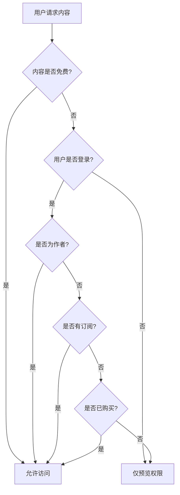

# Rainbow-Blog Phase 4 API 文档

## 🌈 概述

Rainbow-Blog 第四阶段 API 文档，包含会员订阅系统、付费内容管理、创作者收益等商业化功能。

### 基础信息

- **基础URL**: `http://localhost:3001/api/blog`
- **认证方式**: Bearer Token (JWT)
- **内容类型**: `application/json`
- **字符编码**: UTF-8

### 版本信息

- **API版本**: v1
- **文档更新**: 2024-01-20
- **项目阶段**: 第四阶段开发完成

---

## 💳 会员订阅系统 API

会员订阅系统允许创作者创建订阅计划，用户可以订阅创作者获得付费内容访问权限。

### 创建订阅计划

```http
POST /api/blog/subscriptions/plans
```

**认证**: 必需

**请求体**:
```json
{
  "name": "高级会员",
  "description": "获取所有付费内容的访问权限",
  "price": 999,
  "currency": "USD",
  "benefits": [
    "访问所有付费文章",
    "专属内容推送",
    "优先评论权限",
    "月度问答直播"
  ]
}
```

**验证规则**:
- `name`: 必需，1-100 字符
- `description`: 可选，最大 500 字符
- `price`: 必需，价格（美分），≥0
- `currency`: 可选，默认 "USD"，必须是3位货币代码
- `benefits`: 可选，收益列表数组

**响应示例**:
```json
{
  "success": true,
  "data": {
    "id": "subscription_plan:123e4567-e89b-12d3-a456-426614174000",
    "creator_id": "user_456",
    "name": "高级会员",
    "description": "获取所有付费内容的访问权限",
    "price": 999,
    "currency": "USD",
    "benefits": [
      "访问所有付费文章",
      "专属内容推送",
      "优先评论权限",
      "月度问答直播"
    ],
    "is_active": true,
    "created_at": "2024-01-20T10:30:00Z",
    "updated_at": "2024-01-20T10:30:00Z"
  }
}
```

### 获取订阅计划详情

```http
GET /api/blog/subscriptions/plans/{plan_id}
```

**认证**: 不需要

**路径参数**:
- `plan_id` (string): 订阅计划ID

**响应示例**:
```json
{
  "success": true,
  "data": {
    "id": "subscription_plan:123e4567-e89b-12d3-a456-426614174000",
    "creator_id": "user_456",
    "name": "高级会员",
    "description": "获取所有付费内容的访问权限",
    "price": 999,
    "currency": "USD",
    "benefits": [
      "访问所有付费文章",
      "专属内容推送",
      "优先评论权限",
      "月度问答直播"
    ],
    "is_active": true,
    "created_at": "2024-01-20T10:30:00Z",
    "updated_at": "2024-01-20T10:30:00Z"
  }
}
```

### 更新订阅计划

```http
PUT /api/blog/subscriptions/plans/{plan_id}
```

**认证**: 必需（仅计划创建者可更新）

**路径参数**:
- `plan_id` (string): 订阅计划ID

**请求体**:
```json
{
  "name": "超级会员",
  "description": "更新后的描述",
  "price": 1299,
  "benefits": [
    "访问所有付费文章",
    "专属内容推送",
    "优先评论权限",
    "月度问答直播",
    "一对一咨询服务"
  ],
  "is_active": true
}
```

**响应**: 同获取订阅计划详情

### 停用订阅计划

```http
DELETE /api/blog/subscriptions/plans/{plan_id}
```

**认证**: 必需（仅计划创建者可操作）

**路径参数**:
- `plan_id` (string): 订阅计划ID

**响应示例**:
```json
{
  "success": true,
  "data": null
}
```

### 获取创作者的订阅计划列表

```http
GET /api/blog/subscriptions/creator/{creator_id}/plans
```

**认证**: 不需要

**路径参数**:
- `creator_id` (string): 创作者用户ID

**查询参数**:
- `page` (integer): 页码，默认 1
- `limit` (integer): 每页数量，默认 20，最大 100
- `is_active` (boolean): 是否只显示活跃计划

**响应示例**:
```json
{
  "success": true,
  "data": {
    "plans": [
      {
        "id": "subscription_plan:123e4567-e89b-12d3-a456-426614174000",
        "creator_id": "user_456",
        "name": "高级会员",
        "description": "获取所有付费内容的访问权限",
        "price": 999,
        "currency": "USD",
        "benefits": [
          "访问所有付费文章",
          "专属内容推送"
        ],
        "is_active": true,
        "created_at": "2024-01-20T10:30:00Z",
        "updated_at": "2024-01-20T10:30:00Z"
      }
    ],
    "total": 3,
    "page": 1,
    "limit": 20,
    "total_pages": 1
  }
}
```

### 创建订阅

```http
POST /api/blog/subscriptions/
```

**认证**: 必需

**请求体**:
```json
{
  "plan_id": "subscription_plan:123e4567-e89b-12d3-a456-426614174000",
  "payment_method_id": "pm_1234567890abcdef"
}
```

**验证规则**:
- `plan_id`: 必需，有效的订阅计划ID
- `payment_method_id`: 可选，Stripe支付方式ID（启用支付功能时必需）

**响应示例**:
```json
{
  "success": true,
  "data": {
    "id": "subscription:987fcdeb-51a2-43d1-b456-426614174111",
    "subscriber_id": "user_789",
    "plan": {
      "id": "subscription_plan:123e4567-e89b-12d3-a456-426614174000",
      "creator_id": "user_456",
      "name": "高级会员",
      "description": "获取所有付费内容的访问权限",
      "price": 999,
      "currency": "USD",
      "benefits": [
        "访问所有付费文章",
        "专属内容推送"
      ],
      "is_active": true,
      "created_at": "2024-01-20T10:30:00Z",
      "updated_at": "2024-01-20T10:30:00Z"
    },
    "creator": {
      "user_id": "user_456",
      "username": "tech_writer",
      "display_name": "技术写作者",
      "avatar_url": "https://example.com/avatar.jpg",
      "is_verified": true
    },
    "status": "active",
    "started_at": "2024-01-20T11:00:00Z",
    "current_period_end": "2024-02-20T11:00:00Z",
    "canceled_at": null,
    "created_at": "2024-01-20T11:00:00Z",
    "updated_at": "2024-01-20T11:00:00Z"
  }
}
```

### 获取订阅详情

```http
GET /api/blog/subscriptions/{subscription_id}
```

**认证**: 必需（仅订阅者本人或创作者可查看）

**路径参数**:
- `subscription_id` (string): 订阅ID

**响应**: 同创建订阅响应

### 取消订阅

```http
POST /api/blog/subscriptions/{subscription_id}/cancel
```

**认证**: 必需（仅订阅者本人可取消）

**路径参数**:
- `subscription_id` (string): 订阅ID

**响应示例**:
```json
{
  "success": true,
  "data": {
    "id": "subscription:987fcdeb-51a2-43d1-b456-426614174111",
    "subscriber_id": "user_789",
    "plan": {
      "id": "subscription_plan:123e4567-e89b-12d3-a456-426614174000",
      "name": "高级会员"
    },
    "creator": {
      "user_id": "user_456",
      "username": "tech_writer",
      "display_name": "技术写作者"
    },
    "status": "canceled",
    "started_at": "2024-01-20T11:00:00Z",
    "current_period_end": "2024-02-20T11:00:00Z",
    "canceled_at": "2024-01-25T15:30:00Z",
    "created_at": "2024-01-20T11:00:00Z",
    "updated_at": "2024-01-25T15:30:00Z"
  }
}
```

### 获取用户订阅列表

```http
GET /api/blog/subscriptions/user/{user_id}
```

**认证**: 必需（仅用户本人可查看）

**路径参数**:
- `user_id` (string): 用户ID

**查询参数**:
- `page` (integer): 页码，默认 1
- `limit` (integer): 每页数量，默认 20，最大 100
- `status` (string): 订阅状态过滤 (`active`, `canceled`, `expired`, `past_due`)

**响应示例**:
```json
{
  "success": true,
  "data": {
    "subscriptions": [
      {
        "id": "subscription:987fcdeb-51a2-43d1-b456-426614174111",
        "subscriber_id": "user_789",
        "plan": {
          "id": "subscription_plan:123e4567-e89b-12d3-a456-426614174000",
          "name": "高级会员",
          "price": 999,
          "currency": "USD"
        },
        "creator": {
          "user_id": "user_456",
          "username": "tech_writer",
          "display_name": "技术写作者",
          "avatar_url": "https://example.com/avatar.jpg",
          "is_verified": true
        },
        "status": "active",
        "started_at": "2024-01-20T11:00:00Z",
        "current_period_end": "2024-02-20T11:00:00Z",
        "created_at": "2024-01-20T11:00:00Z"
      }
    ],
    "total": 5,
    "page": 1,
    "limit": 20,
    "total_pages": 1
  }
}
```

### 检查用户订阅状态

```http
GET /api/blog/subscriptions/check/{creator_id}
```

**认证**: 必需

**路径参数**:
- `creator_id` (string): 创作者用户ID

**响应示例**:
```json
{
  "success": true,
  "data": {
    "is_subscribed": true,
    "subscription": {
      "id": "subscription:987fcdeb-51a2-43d1-b456-426614174111",
      "plan": {
        "id": "subscription_plan:123e4567-e89b-12d3-a456-426614174000",
        "name": "高级会员"
      },
      "status": "active",
      "current_period_end": "2024-02-20T11:00:00Z"
    },
    "can_access_paid_content": true
  }
}
```

### 获取创作者收益统计

```http
GET /api/blog/subscriptions/creator/{creator_id}/revenue
```

**认证**: 必需（仅创作者本人可查看）

**路径参数**:
- `creator_id` (string): 创作者用户ID

**响应示例**:
```json
{
  "success": true,
  "data": {
    "creator_id": "user_456",
    "total_subscribers": 156,
    "monthly_revenue": 15599,
    "total_revenue": 187188,
    "subscription_plans": [
      {
        "id": "subscription_plan:123e4567-e89b-12d3-a456-426614174000",
        "name": "高级会员",
        "price": 999,
        "currency": "USD",
        "is_active": true
      }
    ],
    "recent_subscriptions": [
      {
        "id": "subscription:987fcdeb-51a2-43d1-b456-426614174111",
        "subscriber_id": "user_789",
        "plan": {
          "name": "高级会员",
          "price": 999
        },
        "status": "active",
        "created_at": "2024-01-20T11:00:00Z"
      }
    ]
  }
}
```

### 处理 Stripe Webhook

```http
POST /api/blog/subscriptions/webhook/stripe
```

**认证**: 不需要（但需要验证Stripe签名）

**请求体**:
```json
{
  "id": "evt_1234567890abcdef",
  "type": "invoice.payment_succeeded",
  "data": {
    "object": {
      "id": "in_1234567890abcdef",
      "subscription": "sub_1234567890abcdef",
      "amount_paid": 999,
      "currency": "usd"
    }
  }
}
```

**支持的事件类型**:
- `subscription.updated` - 订阅更新
- `subscription.deleted` - 订阅删除
- `invoice.payment_succeeded` - 支付成功
- `invoice.payment_failed` - 支付失败

**响应示例**:
```json
{
  "success": true,
  "data": null
}
```

---

## 📊 订阅状态说明

### 订阅状态类型

| 状态 | 说明 | 可访问付费内容 |
|------|------|----------------|
| `active` | 订阅有效 | ✅ |
| `canceled` | 已取消（周期内仍有效） | ✅ |
| `expired` | 已过期 | ❌ |
| `past_due` | 付款逾期 | ❌ |

### 订阅周期

- 所有订阅计划默认为**月度订阅**
- 每个订阅周期为30天
- 取消订阅后，当前周期结束前仍可访问付费内容

---

## 💰 定价和货币

### 支持的货币

目前支持以下货币（使用ISO 4217标准）：
- `USD` - 美元（默认）
- `EUR` - 欧元
- `GBP` - 英镑
- `JPY` - 日元
- `CNY` - 人民币

### 价格格式

- 所有价格以**最小货币单位**表示（例如美分）
- 例如：`999` 表示 $9.99 USD
- 支持 `0` 价格（免费订阅）

---

## 🔒 权限和安全

### 权限验证

- **订阅计划管理**: 仅计划创建者
- **订阅操作**: 仅订阅者本人
- **收益查看**: 仅创作者本人
- **订阅状态检查**: 需要登录

### 数据隐私

- 订阅者个人信息仅对创作者可见
- 创作者收益信息严格保密
- 支付信息通过Stripe安全处理

---

## 🚨 错误处理

### 订阅相关错误码

| 错误码 | HTTP状态码 | 描述 |
|--------|------------|------|
| `SUBSCRIPTION_NOT_FOUND` | 404 | 订阅不存在 |
| `PLAN_NOT_FOUND` | 404 | 订阅计划不存在 |
| `PLAN_INACTIVE` | 400 | 订阅计划已停用 |
| `ALREADY_SUBSCRIBED` | 400 | 已经订阅该创作者 |
| `PAYMENT_REQUIRED` | 402 | 需要支付方式 |
| `SUBSCRIPTION_CANCELED` | 400 | 订阅已取消 |
| `INSUFFICIENT_PERMISSIONS` | 403 | 权限不足 |
| `STRIPE_ERROR` | 502 | Stripe服务错误 |

### 错误响应示例

```json
{
  "success": false,
  "error": {
    "code": "ALREADY_SUBSCRIBED",
    "message": "您已经订阅了该创作者"
  }
}
```

---

## 📈 使用示例

### JavaScript示例

```javascript
// 获取创作者的订阅计划
async function getCreatorPlans(creatorId) {
  const response = await fetch(
    `/api/blog/subscriptions/creator/${creatorId}/plans`
  );
  return response.json();
}

// 创建订阅
async function subscribe(planId, paymentMethodId, token) {
  const response = await fetch('/api/blog/subscriptions/', {
    method: 'POST',
    headers: {
      'Content-Type': 'application/json',
      'Authorization': `Bearer ${token}`
    },
    body: JSON.stringify({
      plan_id: planId,
      payment_method_id: paymentMethodId
    })
  });
  return response.json();
}

// 检查订阅状态
async function checkSubscription(creatorId, token) {
  const response = await fetch(
    `/api/blog/subscriptions/check/${creatorId}`, {
    headers: {
      'Authorization': `Bearer ${token}`
    }
  });
  return response.json();
}
```

### Python示例

```python
import requests

BASE_URL = "http://localhost:3001/api/blog"

# 创建订阅计划
def create_subscription_plan(name, price, benefits, token):
    headers = {
        "Content-Type": "application/json",
        "Authorization": f"Bearer {token}"
    }
    data = {
        "name": name,
        "price": price,
        "benefits": benefits
    }
    response = requests.post(
        f"{BASE_URL}/subscriptions/plans",
        json=data,
        headers=headers
    )
    return response.json()

# 获取用户订阅列表
def get_user_subscriptions(user_id, token):
    headers = {"Authorization": f"Bearer {token}"}
    response = requests.get(
        f"{BASE_URL}/subscriptions/user/{user_id}",
        headers=headers
    )
    return response.json()
```

---

## 🔄 集成指南

### 前端集成步骤

1. **显示订阅计划**: 在创作者页面展示可用计划
2. **订阅流程**: 用户选择计划并完成支付
3. **状态检查**: 在付费内容页面检查订阅状态
4. **管理界面**: 为创作者提供收益和订阅管理

### Stripe集成

1. 配置 Stripe 密钥环境变量
2. 设置 Webhook 端点处理支付事件
3. 在前端集成 Stripe Elements 处理支付

### 内容访问控制

```javascript
// 检查用户是否可以访问付费内容
async function canAccessPaidContent(creatorId, token) {
  const check = await checkSubscription(creatorId, token);
  return check.data.can_access_paid_content;
}
```

---

## 💳 付费内容系统 API

付费内容系统允许创作者设置文章定价，用户可以通过订阅或单次购买获得内容访问权限。

### 检查内容访问权限

```http
GET /api/blog/payments/content/{article_id}/access
```

**认证**: 可选（登录用户获得详细权限，匿名用户仅显示基本信息）

**路径参数**:
- `article_id` (string): 文章ID

**响应示例**:
```json
{
  "success": true,
  "data": {
    "article_id": "article_123",
    "user_id": "user_456",
    "has_access": true,
    "access_type": "subscription",
    "subscription_id": "subscription_789",
    "granted_at": "2024-01-20T10:00:00Z",
    "expires_at": "2024-02-20T10:00:00Z"
  }
}
```

**访问类型说明**:
- `free` - 免费内容
- `subscription` - 通过订阅获得访问权限
- `one_time` - 通过单次购买获得权限
- `author` - 文章作者
- `preview` - 仅预览权限

### 获取内容预览

```http
GET /api/blog/payments/content/{article_id}/preview
```

**认证**: 可选

**路径参数**:
- `article_id` (string): 文章ID

**响应示例**:
```json
{
  "success": true,
  "data": {
    "article_id": "article_123",
    "preview_content": "这是文章的前30%内容...",
    "preview_html": "<p>这是文章的前30%内容...</p>",
    "is_complete": false,
    "paywall_message": "订阅以继续阅读完整内容",
    "subscription_required": true,
    "creator_id": "user_456"
  }
}
```

### 设置文章定价

```http
PUT /api/blog/payments/articles/{article_id}/pricing
```

**认证**: 必需（仅文章作者可设置）

**路径参数**:
- `article_id` (string): 文章ID

**请求体**:
```json
{
  "price": 299,
  "subscription_required": true,
  "preview_percentage": 30,
  "paywall_message": "订阅以继续阅读完整内容"
}
```

**验证规则**:
- `price`: 可选，单次购买价格（美分），≥0，null表示仅订阅
- `subscription_required`: 必需，是否需要订阅
- `preview_percentage`: 可选，预览内容比例（0-100），默认30
- `paywall_message`: 可选，自定义付费墙信息，最大200字符

**响应示例**:
```json
{
  "success": true,
  "data": {
    "article_id": "article_123",
    "is_paid_content": true,
    "price": 299,
    "subscription_required": true,
    "preview_percentage": 30,
    "paywall_message": "订阅以继续阅读完整内容",
    "creator_id": "user_456",
    "created_at": "2024-01-20T10:00:00Z",
    "updated_at": "2024-01-20T10:30:00Z"
  }
}
```

### 获取文章定价信息

```http
GET /api/blog/payments/articles/{article_id}/pricing
```

**认证**: 不需要

**路径参数**:
- `article_id` (string): 文章ID

**响应**: 同设置文章定价响应

### 购买单篇文章

```http
POST /api/blog/payments/articles/purchase
```

**认证**: 必需

**请求体**:
```json
{
  "article_id": "article_123",
  "payment_method_id": "pm_1234567890abcdef"
}
```

**验证规则**:
- `article_id`: 必需，要购买的文章ID
- `payment_method_id`: 可选，Stripe支付方式ID（启用支付功能时必需）

**响应示例**:
```json
{
  "success": true,
  "data": {
    "id": "article_purchase_789",
    "article_id": "article_123",
    "buyer_id": "user_456",
    "creator_id": "user_789",
    "amount": 299,
    "currency": "USD",
    "stripe_payment_intent_id": "pi_1234567890abcdef",
    "status": "completed",
    "created_at": "2024-01-20T11:00:00Z",
    "updated_at": "2024-01-20T11:05:00Z"
  }
}
```

### 获取购买详情

```http
GET /api/blog/payments/purchases/{purchase_id}
```

**认证**: 必需（仅购买者可查看）

**路径参数**:
- `purchase_id` (string): 购买记录ID

**响应**: 同购买文章响应

### 获取付费内容仪表板

```http
GET /api/blog/payments/dashboard/{creator_id}
```

**认证**: 必需（仅创作者本人可查看）

**路径参数**:
- `creator_id` (string): 创作者用户ID

**响应示例**:
```json
{
  "success": true,
  "data": {
    "creator_id": "user_456",
    "total_paid_articles": 15,
    "total_subscribers": 128,
    "total_purchases": 45,
    "monthly_revenue": 1259900,
    "top_earning_articles": [
      {
        "article_id": "article_123",
        "title": "深入理解机器学习",
        "slug": "deep-understanding-ml",
        "total_revenue": 89700,
        "subscription_revenue": 59800,
        "purchase_revenue": 29900,
        "view_count": 1250,
        "purchase_count": 100
      }
    ],
    "recent_purchases": [
      {
        "id": "article_purchase_789",
        "article_id": "article_123",
        "buyer_id": "user_456",
        "creator_id": "user_789",
        "amount": 299,
        "currency": "USD",
        "status": "completed",
        "created_at": "2024-01-20T11:00:00Z",
        "updated_at": "2024-01-20T11:05:00Z"
      }
    ],
    "access_stats": [
      {
        "article_id": "article_123",
        "total_views": 1250,
        "free_views": 0,
        "subscription_views": 850,
        "purchase_views": 200,
        "preview_views": 200,
        "conversion_rate": 85.0,
        "total_revenue": 89700
      }
    ]
  }
}
```

### 记录内容访问

```http
POST /api/blog/payments/access-log
```

**认证**: 必需

**请求体**:
```json
{
  "article_id": "article_123",
  "access_type": "subscription",
  "reading_time": 300
}
```

**验证规则**:
- `article_id`: 必需，访问的文章ID
- `access_type`: 必需，访问类型（free/subscription/one_time/author/preview）
- `reading_time`: 可选，阅读时间（秒）

**响应示例**:
```json
{
  "success": true,
  "data": null
}
```

### 获取收益分析

```http
GET /api/blog/payments/earnings
```

**认证**: 必需

**查询参数**:
- `creator_id` (string): 可选，创作者ID（如不指定使用当前用户）
- `article_id` (string): 可选，特定文章ID
- `start_date` (datetime): 可选，开始日期
- `end_date` (datetime): 可选，结束日期
- `limit` (integer): 可选，返回数量限制

**响应示例**:
```json
{
  "success": true,
  "data": {
    "creator_id": "user_456",
    "total_revenue": 1259900,
    "paid_articles_count": 15,
    "subscribers_count": 128,
    "purchases_count": 45,
    "top_earning_articles": [...],
    "access_stats": [...]
  }
}
```

### 获取单篇文章收益

```http
GET /api/blog/payments/earnings/articles/{article_id}
```

**认证**: 必需（仅文章作者可查看）

**路径参数**:
- `article_id` (string): 文章ID

**响应示例**:
```json
{
  "success": true,
  "data": {
    "article_id": "article_123",
    "title": "深入理解机器学习",
    "slug": "deep-understanding-ml",
    "total_revenue": 89700,
    "subscription_revenue": 59800,
    "purchase_revenue": 29900,
    "view_count": 1250,
    "purchase_count": 100
  }
}
```

---

## 💰 付费内容定价说明

### 定价模式

支持两种付费模式：

1. **仅订阅模式**
   - 设置 `subscription_required: true`，`price: null`
   - 用户必须订阅创作者才能访问

2. **订阅+单次购买模式**
   - 设置 `subscription_required: true`，`price: 299`
   - 用户可选择订阅或单次购买

3. **仅单次购买模式**
   - 设置 `subscription_required: false`，`price: 299`
   - 用户只能通过单次购买访问

### 预览设置

- `preview_percentage`: 预览内容百分比（0-100）
- 按段落计算，最少显示1个段落
- `paywall_message`: 自定义付费墙提示信息

---

## 🔒 付费内容权限验证

### 访问权限检查流程

1. **免费内容**: 直接允许访问
2. **未登录用户**: 只能预览付费内容
3. **文章作者**: 完全访问权限
4. **订阅用户**: 检查有效订阅状态
5. **购买用户**: 检查购买记录
6. **其他用户**: 仅预览权限

### 权限验证顺序



---

## 📊 收益统计说明

### 仪表板指标

- **总付费文章数**: 设为付费的文章总数
- **总订阅数**: 活跃订阅用户数
- **总购买数**: 单次购买总数
- **月度收益**: 当前月份总收入（美分）

### 文章收益分析

- **订阅收益**: 通过订阅产生的收益
- **购买收益**: 通过单次购买产生的收益
- **转换率**: 预览访问转为付费访问的比例

---

## 🚨 付费内容错误处理

### 付费相关错误码

| 错误码 | HTTP状态码 | 描述 |
|--------|------------|------|
| `CONTENT_ACCESS_DENIED` | 403 | 内容访问权限不足 |
| `ARTICLE_NOT_PAID` | 400 | 文章不是付费内容 |
| `ALREADY_PURCHASED` | 400 | 文章已经购买 |
| `SUBSCRIPTION_REQUIRED` | 402 | 需要订阅才能访问 |
| `PAYMENT_REQUIRED` | 402 | 需要付费才能访问 |
| `INSUFFICIENT_PERMISSIONS` | 403 | 权限不足 |

---

*本文档涵盖了 Rainbow-Blog 第四阶段会员订阅系统和付费内容系统的完整 API 规范。更多功能正在开发中...*