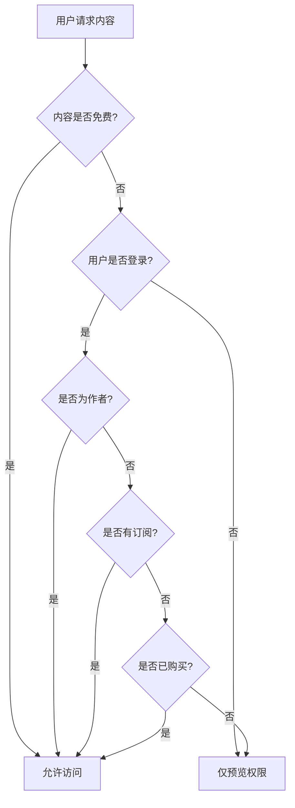
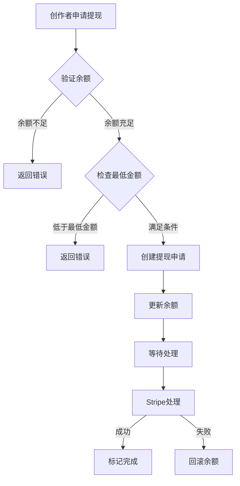

# Rainbow-Blog Phase 4 API 文档

## 🌈 概述

Rainbow-Blog 第四阶段 API 文档，包含会员订阅系统、付费内容管理、创作者收益等商业化功能。

### 基础信息

- **基础URL**: `http://localhost:3001/api/blog`
- **认证方式**: Bearer Token (JWT)
- **内容类型**: `application/json`
- **字符编码**: UTF-8

### 版本信息

- **API版本**: v1
- **文档更新**: 2024-01-20
- **项目阶段**: 第四阶段开发完成

---

## 💳 会员订阅系统 API

会员订阅系统允许创作者创建订阅计划，用户可以订阅创作者获得付费内容访问权限。

### 创建订阅计划

```http
POST /api/blog/subscriptions/plans
```

**认证**: 必需

**请求体**:
```json
{
  "name": "高级会员",
  "description": "获取所有付费内容的访问权限",
  "price": 999,
  "currency": "USD",
  "benefits": [
    "访问所有付费文章",
    "专属内容推送",
    "优先评论权限",
    "月度问答直播"
  ]
}
```

**验证规则**:
- `name`: 必需，1-100 字符
- `description`: 可选，最大 500 字符
- `price`: 必需，价格（美分），≥0
- `currency`: 可选，默认 "USD"，必须是3位货币代码
- `benefits`: 可选，收益列表数组

**响应示例**:
```json
{
  "success": true,
  "data": {
    "id": "subscription_plan:123e4567-e89b-12d3-a456-426614174000",
    "creator_id": "user_456",
    "name": "高级会员",
    "description": "获取所有付费内容的访问权限",
    "price": 999,
    "currency": "USD",
    "benefits": [
      "访问所有付费文章",
      "专属内容推送",
      "优先评论权限",
      "月度问答直播"
    ],
    "is_active": true,
    "created_at": "2024-01-20T10:30:00Z",
    "updated_at": "2024-01-20T10:30:00Z"
  }
}
```

### 获取订阅计划详情

```http
GET /api/blog/subscriptions/plans/{plan_id}
```

**认证**: 不需要

**路径参数**:
- `plan_id` (string): 订阅计划ID

**响应示例**:
```json
{
  "success": true,
  "data": {
    "id": "subscription_plan:123e4567-e89b-12d3-a456-426614174000",
    "creator_id": "user_456",
    "name": "高级会员",
    "description": "获取所有付费内容的访问权限",
    "price": 999,
    "currency": "USD",
    "benefits": [
      "访问所有付费文章",
      "专属内容推送",
      "优先评论权限",
      "月度问答直播"
    ],
    "is_active": true,
    "created_at": "2024-01-20T10:30:00Z",
    "updated_at": "2024-01-20T10:30:00Z"
  }
}
```

### 更新订阅计划

```http
PUT /api/blog/subscriptions/plans/{plan_id}
```

**认证**: 必需（仅计划创建者可更新）

**路径参数**:
- `plan_id` (string): 订阅计划ID

**请求体**:
```json
{
  "name": "超级会员",
  "description": "更新后的描述",
  "price": 1299,
  "benefits": [
    "访问所有付费文章",
    "专属内容推送",
    "优先评论权限",
    "月度问答直播",
    "一对一咨询服务"
  ],
  "is_active": true
}
```

**响应**: 同获取订阅计划详情

### 停用订阅计划

```http
DELETE /api/blog/subscriptions/plans/{plan_id}
```

**认证**: 必需（仅计划创建者可操作）

**路径参数**:
- `plan_id` (string): 订阅计划ID

**响应示例**:
```json
{
  "success": true,
  "data": null
}
```

### 获取创作者的订阅计划列表

```http
GET /api/blog/subscriptions/creator/{creator_id}/plans
```

**认证**: 不需要

**路径参数**:
- `creator_id` (string): 创作者用户ID

**查询参数**:
- `page` (integer): 页码，默认 1
- `limit` (integer): 每页数量，默认 20，最大 100
- `is_active` (boolean): 是否只显示活跃计划

**响应示例**:
```json
{
  "success": true,
  "data": {
    "plans": [
      {
        "id": "subscription_plan:123e4567-e89b-12d3-a456-426614174000",
        "creator_id": "user_456",
        "name": "高级会员",
        "description": "获取所有付费内容的访问权限",
        "price": 999,
        "currency": "USD",
        "benefits": [
          "访问所有付费文章",
          "专属内容推送"
        ],
        "is_active": true,
        "created_at": "2024-01-20T10:30:00Z",
        "updated_at": "2024-01-20T10:30:00Z"
      }
    ],
    "total": 3,
    "page": 1,
    "limit": 20,
    "total_pages": 1
  }
}
```

### 创建订阅

```http
POST /api/blog/subscriptions/
```

**认证**: 必需

**请求体**:
```json
{
  "plan_id": "subscription_plan:123e4567-e89b-12d3-a456-426614174000",
  "payment_method_id": "pm_1234567890abcdef"
}
```

**验证规则**:
- `plan_id`: 必需，有效的订阅计划ID
- `payment_method_id`: 可选，Stripe支付方式ID（启用支付功能时必需）

**响应示例**:
```json
{
  "success": true,
  "data": {
    "id": "subscription:987fcdeb-51a2-43d1-b456-426614174111",
    "subscriber_id": "user_789",
    "plan": {
      "id": "subscription_plan:123e4567-e89b-12d3-a456-426614174000",
      "creator_id": "user_456",
      "name": "高级会员",
      "description": "获取所有付费内容的访问权限",
      "price": 999,
      "currency": "USD",
      "benefits": [
        "访问所有付费文章",
        "专属内容推送"
      ],
      "is_active": true,
      "created_at": "2024-01-20T10:30:00Z",
      "updated_at": "2024-01-20T10:30:00Z"
    },
    "creator": {
      "user_id": "user_456",
      "username": "tech_writer",
      "display_name": "技术写作者",
      "avatar_url": "https://example.com/avatar.jpg",
      "is_verified": true
    },
    "status": "active",
    "started_at": "2024-01-20T11:00:00Z",
    "current_period_end": "2024-02-20T11:00:00Z",
    "canceled_at": null,
    "created_at": "2024-01-20T11:00:00Z",
    "updated_at": "2024-01-20T11:00:00Z"
  }
}
```

### 获取订阅详情

```http
GET /api/blog/subscriptions/{subscription_id}
```

**认证**: 必需（仅订阅者本人或创作者可查看）

**路径参数**:
- `subscription_id` (string): 订阅ID

**响应**: 同创建订阅响应

### 取消订阅

```http
POST /api/blog/subscriptions/{subscription_id}/cancel
```

**认证**: 必需（仅订阅者本人可取消）

**路径参数**:
- `subscription_id` (string): 订阅ID

**响应示例**:
```json
{
  "success": true,
  "data": {
    "id": "subscription:987fcdeb-51a2-43d1-b456-426614174111",
    "subscriber_id": "user_789",
    "plan": {
      "id": "subscription_plan:123e4567-e89b-12d3-a456-426614174000",
      "name": "高级会员"
    },
    "creator": {
      "user_id": "user_456",
      "username": "tech_writer",
      "display_name": "技术写作者"
    },
    "status": "canceled",
    "started_at": "2024-01-20T11:00:00Z",
    "current_period_end": "2024-02-20T11:00:00Z",
    "canceled_at": "2024-01-25T15:30:00Z",
    "created_at": "2024-01-20T11:00:00Z",
    "updated_at": "2024-01-25T15:30:00Z"
  }
}
```

### 获取用户订阅列表

```http
GET /api/blog/subscriptions/user/{user_id}
```

**认证**: 必需（仅用户本人可查看）

**路径参数**:
- `user_id` (string): 用户ID

**查询参数**:
- `page` (integer): 页码，默认 1
- `limit` (integer): 每页数量，默认 20，最大 100
- `status` (string): 订阅状态过滤 (`active`, `canceled`, `expired`, `past_due`)

**响应示例**:
```json
{
  "success": true,
  "data": {
    "subscriptions": [
      {
        "id": "subscription:987fcdeb-51a2-43d1-b456-426614174111",
        "subscriber_id": "user_789",
        "plan": {
          "id": "subscription_plan:123e4567-e89b-12d3-a456-426614174000",
          "name": "高级会员",
          "price": 999,
          "currency": "USD"
        },
        "creator": {
          "user_id": "user_456",
          "username": "tech_writer",
          "display_name": "技术写作者",
          "avatar_url": "https://example.com/avatar.jpg",
          "is_verified": true
        },
        "status": "active",
        "started_at": "2024-01-20T11:00:00Z",
        "current_period_end": "2024-02-20T11:00:00Z",
        "created_at": "2024-01-20T11:00:00Z"
      }
    ],
    "total": 5,
    "page": 1,
    "limit": 20,
    "total_pages": 1
  }
}
```

### 检查用户订阅状态

```http
GET /api/blog/subscriptions/check/{creator_id}
```

**认证**: 必需

**路径参数**:
- `creator_id` (string): 创作者用户ID

**响应示例**:
```json
{
  "success": true,
  "data": {
    "is_subscribed": true,
    "subscription": {
      "id": "subscription:987fcdeb-51a2-43d1-b456-426614174111",
      "plan": {
        "id": "subscription_plan:123e4567-e89b-12d3-a456-426614174000",
        "name": "高级会员"
      },
      "status": "active",
      "current_period_end": "2024-02-20T11:00:00Z"
    },
    "can_access_paid_content": true
  }
}
```

### 获取创作者收益统计

```http
GET /api/blog/subscriptions/creator/{creator_id}/revenue
```

**认证**: 必需（仅创作者本人可查看）

**路径参数**:
- `creator_id` (string): 创作者用户ID

**响应示例**:
```json
{
  "success": true,
  "data": {
    "creator_id": "user_456",
    "total_subscribers": 156,
    "monthly_revenue": 15599,
    "total_revenue": 187188,
    "subscription_plans": [
      {
        "id": "subscription_plan:123e4567-e89b-12d3-a456-426614174000",
        "name": "高级会员",
        "price": 999,
        "currency": "USD",
        "is_active": true
      }
    ],
    "recent_subscriptions": [
      {
        "id": "subscription:987fcdeb-51a2-43d1-b456-426614174111",
        "subscriber_id": "user_789",
        "plan": {
          "name": "高级会员",
          "price": 999
        },
        "status": "active",
        "created_at": "2024-01-20T11:00:00Z"
      }
    ]
  }
}
```

### 处理 Stripe Webhook

```http
POST /api/blog/subscriptions/webhook/stripe
```

**认证**: 不需要（但需要验证Stripe签名）

**请求体**:
```json
{
  "id": "evt_1234567890abcdef",
  "type": "invoice.payment_succeeded",
  "data": {
    "object": {
      "id": "in_1234567890abcdef",
      "subscription": "sub_1234567890abcdef",
      "amount_paid": 999,
      "currency": "usd"
    }
  }
}
```

**支持的事件类型**:
- `subscription.updated` - 订阅更新
- `subscription.deleted` - 订阅删除
- `invoice.payment_succeeded` - 支付成功
- `invoice.payment_failed` - 支付失败

**响应示例**:
```json
{
  "success": true,
  "data": null
}
```

---

## 📊 订阅状态说明

### 订阅状态类型

| 状态 | 说明 | 可访问付费内容 |
|------|------|----------------|
| `active` | 订阅有效 | ✅ |
| `canceled` | 已取消（周期内仍有效） | ✅ |
| `expired` | 已过期 | ❌ |
| `past_due` | 付款逾期 | ❌ |

### 订阅周期

- 所有订阅计划默认为**月度订阅**
- 每个订阅周期为30天
- 取消订阅后，当前周期结束前仍可访问付费内容

---

## 💰 定价和货币

### 支持的货币

目前支持以下货币（使用ISO 4217标准）：
- `USD` - 美元（默认）
- `EUR` - 欧元
- `GBP` - 英镑
- `JPY` - 日元
- `CNY` - 人民币

### 价格格式

- 所有价格以**最小货币单位**表示（例如美分）
- 例如：`999` 表示 $9.99 USD
- 支持 `0` 价格（免费订阅）

---

## 🔒 权限和安全

### 权限验证

- **订阅计划管理**: 仅计划创建者
- **订阅操作**: 仅订阅者本人
- **收益查看**: 仅创作者本人
- **订阅状态检查**: 需要登录

### 数据隐私

- 订阅者个人信息仅对创作者可见
- 创作者收益信息严格保密
- 支付信息通过Stripe安全处理

---

## 🚨 错误处理

### 订阅相关错误码

| 错误码 | HTTP状态码 | 描述 |
|--------|------------|------|
| `SUBSCRIPTION_NOT_FOUND` | 404 | 订阅不存在 |
| `PLAN_NOT_FOUND` | 404 | 订阅计划不存在 |
| `PLAN_INACTIVE` | 400 | 订阅计划已停用 |
| `ALREADY_SUBSCRIBED` | 400 | 已经订阅该创作者 |
| `PAYMENT_REQUIRED` | 402 | 需要支付方式 |
| `SUBSCRIPTION_CANCELED` | 400 | 订阅已取消 |
| `INSUFFICIENT_PERMISSIONS` | 403 | 权限不足 |
| `STRIPE_ERROR` | 502 | Stripe服务错误 |

### 错误响应示例

```json
{
  "success": false,
  "error": {
    "code": "ALREADY_SUBSCRIBED",
    "message": "您已经订阅了该创作者"
  }
}
```

---

## 📈 使用示例

### JavaScript示例

```javascript
// 获取创作者的订阅计划
async function getCreatorPlans(creatorId) {
  const response = await fetch(
    `/api/blog/subscriptions/creator/${creatorId}/plans`
  );
  return response.json();
}

// 创建订阅
async function subscribe(planId, paymentMethodId, token) {
  const response = await fetch('/api/blog/subscriptions/', {
    method: 'POST',
    headers: {
      'Content-Type': 'application/json',
      'Authorization': `Bearer ${token}`
    },
    body: JSON.stringify({
      plan_id: planId,
      payment_method_id: paymentMethodId
    })
  });
  return response.json();
}

// 检查订阅状态
async function checkSubscription(creatorId, token) {
  const response = await fetch(
    `/api/blog/subscriptions/check/${creatorId}`, {
    headers: {
      'Authorization': `Bearer ${token}`
    }
  });
  return response.json();
}
```

### Python示例

```python
import requests

BASE_URL = "http://localhost:3001/api/blog"

# 创建订阅计划
def create_subscription_plan(name, price, benefits, token):
    headers = {
        "Content-Type": "application/json",
        "Authorization": f"Bearer {token}"
    }
    data = {
        "name": name,
        "price": price,
        "benefits": benefits
    }
    response = requests.post(
        f"{BASE_URL}/subscriptions/plans",
        json=data,
        headers=headers
    )
    return response.json()

# 获取用户订阅列表
def get_user_subscriptions(user_id, token):
    headers = {"Authorization": f"Bearer {token}"}
    response = requests.get(
        f"{BASE_URL}/subscriptions/user/{user_id}",
        headers=headers
    )
    return response.json()
```

---

## 🔄 集成指南

### 前端集成步骤

1. **显示订阅计划**: 在创作者页面展示可用计划
2. **订阅流程**: 用户选择计划并完成支付
3. **状态检查**: 在付费内容页面检查订阅状态
4. **管理界面**: 为创作者提供收益和订阅管理

### Stripe集成

1. 配置 Stripe 密钥环境变量
2. 设置 Webhook 端点处理支付事件
3. 在前端集成 Stripe Elements 处理支付

### 内容访问控制

```javascript
// 检查用户是否可以访问付费内容
async function canAccessPaidContent(creatorId, token) {
  const check = await checkSubscription(creatorId, token);
  return check.data.can_access_paid_content;
}
```

---

## 💳 付费内容系统 API

付费内容系统允许创作者设置文章定价，用户可以通过订阅或单次购买获得内容访问权限。

### 检查内容访问权限

```http
GET /api/blog/payments/content/{article_id}/access
```

**认证**: 可选（登录用户获得详细权限，匿名用户仅显示基本信息）

**路径参数**:
- `article_id` (string): 文章ID

**响应示例**:
```json
{
  "success": true,
  "data": {
    "article_id": "article_123",
    "user_id": "user_456",
    "has_access": true,
    "access_type": "subscription",
    "subscription_id": "subscription_789",
    "granted_at": "2024-01-20T10:00:00Z",
    "expires_at": "2024-02-20T10:00:00Z"
  }
}
```

**访问类型说明**:
- `free` - 免费内容
- `subscription` - 通过订阅获得访问权限
- `one_time` - 通过单次购买获得权限
- `author` - 文章作者
- `preview` - 仅预览权限

### 获取内容预览

```http
GET /api/blog/payments/content/{article_id}/preview
```

**认证**: 可选

**路径参数**:
- `article_id` (string): 文章ID

**响应示例**:
```json
{
  "success": true,
  "data": {
    "article_id": "article_123",
    "preview_content": "这是文章的前30%内容...",
    "preview_html": "<p>这是文章的前30%内容...</p>",
    "is_complete": false,
    "paywall_message": "订阅以继续阅读完整内容",
    "subscription_required": true,
    "creator_id": "user_456"
  }
}
```

### 设置文章定价

```http
PUT /api/blog/payments/articles/{article_id}/pricing
```

**认证**: 必需（仅文章作者可设置）

**路径参数**:
- `article_id` (string): 文章ID

**请求体**:
```json
{
  "price": 299,
  "subscription_required": true,
  "preview_percentage": 30,
  "paywall_message": "订阅以继续阅读完整内容"
}
```

**验证规则**:
- `price`: 可选，单次购买价格（美分），≥0，null表示仅订阅
- `subscription_required`: 必需，是否需要订阅
- `preview_percentage`: 可选，预览内容比例（0-100），默认30
- `paywall_message`: 可选，自定义付费墙信息，最大200字符

**响应示例**:
```json
{
  "success": true,
  "data": {
    "article_id": "article_123",
    "is_paid_content": true,
    "price": 299,
    "subscription_required": true,
    "preview_percentage": 30,
    "paywall_message": "订阅以继续阅读完整内容",
    "creator_id": "user_456",
    "created_at": "2024-01-20T10:00:00Z",
    "updated_at": "2024-01-20T10:30:00Z"
  }
}
```

### 获取文章定价信息

```http
GET /api/blog/payments/articles/{article_id}/pricing
```

**认证**: 不需要

**路径参数**:
- `article_id` (string): 文章ID

**响应**: 同设置文章定价响应

### 购买单篇文章

```http
POST /api/blog/payments/articles/purchase
```

**认证**: 必需

**请求体**:
```json
{
  "article_id": "article_123",
  "payment_method_id": "pm_1234567890abcdef"
}
```

**验证规则**:
- `article_id`: 必需，要购买的文章ID
- `payment_method_id`: 可选，Stripe支付方式ID（启用支付功能时必需）

**响应示例**:
```json
{
  "success": true,
  "data": {
    "id": "article_purchase_789",
    "article_id": "article_123",
    "buyer_id": "user_456",
    "creator_id": "user_789",
    "amount": 299,
    "currency": "USD",
    "stripe_payment_intent_id": "pi_1234567890abcdef",
    "status": "completed",
    "created_at": "2024-01-20T11:00:00Z",
    "updated_at": "2024-01-20T11:05:00Z"
  }
}
```

### 获取购买详情

```http
GET /api/blog/payments/purchases/{purchase_id}
```

**认证**: 必需（仅购买者可查看）

**路径参数**:
- `purchase_id` (string): 购买记录ID

**响应**: 同购买文章响应

### 获取付费内容仪表板

```http
GET /api/blog/payments/dashboard/{creator_id}
```

**认证**: 必需（仅创作者本人可查看）

**路径参数**:
- `creator_id` (string): 创作者用户ID

**响应示例**:
```json
{
  "success": true,
  "data": {
    "creator_id": "user_456",
    "total_paid_articles": 15,
    "total_subscribers": 128,
    "total_purchases": 45,
    "monthly_revenue": 1259900,
    "top_earning_articles": [
      {
        "article_id": "article_123",
        "title": "深入理解机器学习",
        "slug": "deep-understanding-ml",
        "total_revenue": 89700,
        "subscription_revenue": 59800,
        "purchase_revenue": 29900,
        "view_count": 1250,
        "purchase_count": 100
      }
    ],
    "recent_purchases": [
      {
        "id": "article_purchase_789",
        "article_id": "article_123",
        "buyer_id": "user_456",
        "creator_id": "user_789",
        "amount": 299,
        "currency": "USD",
        "status": "completed",
        "created_at": "2024-01-20T11:00:00Z",
        "updated_at": "2024-01-20T11:05:00Z"
      }
    ],
    "access_stats": [
      {
        "article_id": "article_123",
        "total_views": 1250,
        "free_views": 0,
        "subscription_views": 850,
        "purchase_views": 200,
        "preview_views": 200,
        "conversion_rate": 85.0,
        "total_revenue": 89700
      }
    ]
  }
}
```

### 记录内容访问

```http
POST /api/blog/payments/access-log
```

**认证**: 必需

**请求体**:
```json
{
  "article_id": "article_123",
  "access_type": "subscription",
  "reading_time": 300
}
```

**验证规则**:
- `article_id`: 必需，访问的文章ID
- `access_type`: 必需，访问类型（free/subscription/one_time/author/preview）
- `reading_time`: 可选，阅读时间（秒）

**响应示例**:
```json
{
  "success": true,
  "data": null
}
```

### 获取收益分析

```http
GET /api/blog/payments/earnings
```

**认证**: 必需

**查询参数**:
- `creator_id` (string): 可选，创作者ID（如不指定使用当前用户）
- `article_id` (string): 可选，特定文章ID
- `start_date` (datetime): 可选，开始日期
- `end_date` (datetime): 可选，结束日期
- `limit` (integer): 可选，返回数量限制

**响应示例**:
```json
{
  "success": true,
  "data": {
    "creator_id": "user_456",
    "total_revenue": 1259900,
    "paid_articles_count": 15,
    "subscribers_count": 128,
    "purchases_count": 45,
    "top_earning_articles": [...],
    "access_stats": [...]
  }
}
```

### 获取单篇文章收益

```http
GET /api/blog/payments/earnings/articles/{article_id}
```

**认证**: 必需（仅文章作者可查看）

**路径参数**:
- `article_id` (string): 文章ID

**响应示例**:
```json
{
  "success": true,
  "data": {
    "article_id": "article_123",
    "title": "深入理解机器学习",
    "slug": "deep-understanding-ml",
    "total_revenue": 89700,
    "subscription_revenue": 59800,
    "purchase_revenue": 29900,
    "view_count": 1250,
    "purchase_count": 100
  }
}
```

---

## 💰 付费内容定价说明

### 定价模式

支持两种付费模式：

1. **仅订阅模式**
   - 设置 `subscription_required: true`，`price: null`
   - 用户必须订阅创作者才能访问

2. **订阅+单次购买模式**
   - 设置 `subscription_required: true`，`price: 299`
   - 用户可选择订阅或单次购买

3. **仅单次购买模式**
   - 设置 `subscription_required: false`，`price: 299`
   - 用户只能通过单次购买访问

### 预览设置

- `preview_percentage`: 预览内容百分比（0-100）
- 按段落计算，最少显示1个段落
- `paywall_message`: 自定义付费墙提示信息

---

## 🔒 付费内容权限验证

### 访问权限检查流程

1. **免费内容**: 直接允许访问
2. **未登录用户**: 只能预览付费内容
3. **文章作者**: 完全访问权限
4. **订阅用户**: 检查有效订阅状态
5. **购买用户**: 检查购买记录
6. **其他用户**: 仅预览权限

### 权限验证顺序



---

## 📊 收益统计说明

### 仪表板指标

- **总付费文章数**: 设为付费的文章总数
- **总订阅数**: 活跃订阅用户数
- **总购买数**: 单次购买总数
- **月度收益**: 当前月份总收入（美分）

### 文章收益分析

- **订阅收益**: 通过订阅产生的收益
- **购买收益**: 通过单次购买产生的收益
- **转换率**: 预览访问转为付费访问的比例

---

## 🚨 付费内容错误处理

### 付费相关错误码

| 错误码 | HTTP状态码 | 描述 |
|--------|------------|------|
| `CONTENT_ACCESS_DENIED` | 403 | 内容访问权限不足 |
| `ARTICLE_NOT_PAID` | 400 | 文章不是付费内容 |
| `ALREADY_PURCHASED` | 400 | 文章已经购买 |
| `SUBSCRIPTION_REQUIRED` | 402 | 需要订阅才能访问 |
| `PAYMENT_REQUIRED` | 402 | 需要付费才能访问 |
| `INSUFFICIENT_PERMISSIONS` | 403 | 权限不足 |

---

## 💰 作者收益系统 API

作者收益系统处理创作者的收益统计、支付和银行账户管理。

### 获取收益仪表板

```http
GET /api/blog/revenue/dashboard
```

**认证**: 必需

**响应示例**:
```json
{
  "success": true,
  "data": {
    "earnings": {
      "creator_id": "user_456",
      "total_earnings": 125990,
      "available_balance": 89700,
      "pending_balance": 36290,
      "lifetime_earnings": 245690,
      "currency": "USD",
      "last_payout_at": "2024-01-15T10:00:00Z",
      "updated_at": "2024-01-20T12:00:00Z"
    },
    "current_month_stats": {
      "period": "monthly",
      "start_date": "2024-01-01T00:00:00Z",
      "end_date": "2024-02-01T00:00:00Z",
      "subscription_revenue": 89700,
      "purchase_revenue": 29900,
      "tip_revenue": 5990,
      "ad_revenue": 400,
      "total_revenue": 125990,
      "transaction_count": 45,
      "new_subscribers": 12,
      "cancelled_subscribers": 2,
      "top_earning_content": [...]
    },
    "last_month_stats": {...},
    "recent_transactions": [...],
    "pending_payouts": [...],
    "bank_accounts": [...],
    "minimum_payout_amount": 5000,
    "next_payout_date": "2024-02-01T00:00:00Z"
  }
}
```

### 获取收益统计

```http
GET /api/blog/revenue/stats
```

**认证**: 必需

**查询参数**:
- `period` (string): 统计周期 - daily/weekly/monthly/yearly/custom
- `start_date` (datetime): 开始日期（自定义周期时必需）
- `end_date` (datetime): 结束日期（自定义周期时必需）

**响应示例**:
```json
{
  "success": true,
  "data": {
    "period": "monthly",
    "start_date": "2024-01-01T00:00:00Z",
    "end_date": "2024-02-01T00:00:00Z",
    "subscription_revenue": 89700,
    "purchase_revenue": 29900,
    "tip_revenue": 5990,
    "ad_revenue": 400,
    "total_revenue": 125990,
    "transaction_count": 45,
    "new_subscribers": 12,
    "cancelled_subscribers": 2,
    "top_earning_content": [
      {
        "content_id": "article_123",
        "content_type": "article",
        "title": "深入理解机器学习",
        "subscription_revenue": 29900,
        "purchase_revenue": 15960,
        "total_revenue": 45860,
        "view_count": 1250,
        "conversion_rate": 85.5
      }
    ]
  }
}
```

### 获取收益交易记录

```http
GET /api/blog/revenue/transactions
```

**认证**: 必需

**查询参数**:
- `page` (integer): 页码，默认1
- `per_page` (integer): 每页数量，默认20，最大100
- `source_type` (string): 收益来源类型 - subscription/article_purchase/tip/advertisement
- `status` (string): 状态 - pending/processing/completed/failed/cancelled

**响应示例**:
```json
{
  "success": true,
  "data": {
    "transactions": [
      {
        "id": "revenue_789",
        "creator_id": "user_456",
        "source_type": "subscription",
        "source_id": "subscription_123",
        "amount": 2610,
        "currency": "USD",
        "status": "completed",
        "period_start": "2024-01-01T00:00:00Z",
        "period_end": "2024-02-01T00:00:00Z",
        "created_at": "2024-01-20T10:00:00Z",
        "processed_at": "2024-01-20T10:05:00Z"
      }
    ],
    "pagination": {
      "page": 1,
      "per_page": 20,
      "total": 156,
      "pages": 8
    }
  }
}
```

### 创建支付申请

```http
POST /api/blog/revenue/payouts
```

**认证**: 必需

**请求体**:
```json
{
  "amount": 10000,
  "description": "月度收益提现",
  "bank_account_id": "bank_account_456"
}
```

**验证规则**:
- `amount`: 必需，支付金额（美分），≥500（$5最低提现）
- `description`: 可选，支付描述，最大500字符
- `bank_account_id`: 可选，银行账户ID（未指定使用默认账户）

**响应示例**:
```json
{
  "success": true,
  "data": {
    "id": "payout_789",
    "creator_id": "user_456",
    "amount": 10000,
    "currency": "USD",
    "method": "stripe",
    "status": "pending",
    "bank_account_id": "bank_account_456",
    "description": "月度收益提现",
    "created_at": "2024-01-20T11:00:00Z",
    "processed_at": null,
    "failed_at": null,
    "failure_reason": null
  }
}
```

### 获取支付列表

```http
GET /api/blog/revenue/payouts
```

**认证**: 必需

**响应**: 返回最近50条支付记录

### 获取支付详情

```http
GET /api/blog/revenue/payouts/{payout_id}
```

**认证**: 必需（仅创作者本人可查看）

**路径参数**:
- `payout_id` (string): 支付记录ID

### 获取银行账户列表

```http
GET /api/blog/revenue/bank-accounts
```

**认证**: 必需

**响应示例**:
```json
{
  "success": true,
  "data": [
    {
      "id": "bank_account_456",
      "creator_id": "user_456",
      "account_holder_name": "张三",
      "account_number_last4": "1234",
      "bank_name": "中国工商银行",
      "country": "CN",
      "currency": "USD",
      "is_default": true,
      "is_verified": true,
      "created_at": "2024-01-15T10:00:00Z",
      "verified_at": "2024-01-15T10:30:00Z"
    }
  ]
}
```

### 添加银行账户

```http
POST /api/blog/revenue/bank-accounts
```

**认证**: 必需

**请求体**:
```json
{
  "account_holder_name": "张三",
  "bank_name": "中国工商银行",
  "country": "CN",
  "currency": "USD",
  "stripe_bank_account_token": "btok_1234567890abcdef"
}
```

### 验证银行账户

```http
POST /api/blog/revenue/bank-accounts/{account_id}/verify
```

**认证**: 必需

**路径参数**:
- `account_id` (string): 银行账户ID

**响应示例**:
```json
{
  "success": true,
  "message": "银行账户验证成功"
}
```

### 设置默认银行账户

```http
POST /api/blog/revenue/bank-accounts/{account_id}/default
```

**认证**: 必需

**路径参数**:
- `account_id` (string): 银行账户ID

**响应示例**:
```json
{
  "success": true,
  "message": "默认银行账户设置成功"
}
```

### 获取收益设置

```http
GET /api/blog/revenue/settings
```

**认证**: 必需

**响应示例**:
```json
{
  "success": true,
  "data": {
    "revenue_share": {
      "platform_fee_percentage": 10.0,
      "payment_processing_fee": 2.9,
      "creator_share_percentage": 87.1
    },
    "minimum_payout_amount": 5000,
    "payout_schedule": "monthly",
    "payout_day": 1,
    "auto_payout_enabled": false,
    "tax_reporting_enabled": false
  }
}
```

### 更新收益设置

```http
POST /api/blog/revenue/settings
```

**认证**: 必需

**请求体**:
```json
{
  "auto_payout_enabled": true,
  "minimum_auto_payout_amount": 10000,
  "tax_reporting_enabled": true
}
```

**验证规则**:
- `auto_payout_enabled`: 可选，是否启用自动提现
- `minimum_auto_payout_amount`: 可选，自动提现最低金额（美分）
- `tax_reporting_enabled`: 可选，是否启用税务报告

**响应示例**:
```json
{
  "success": true,
  "message": "收益设置更新成功"
}
```

---

## 💸 收益分成说明

### 收益分成结构

Rainbow-Blog 采用透明的收益分成模式：

| 项目 | 比例 | 说明 |
|------|------|------|
| 创作者收益 | 87.1% | 创作者实际获得的收益 |
| 平台服务费 | 10.0% | 平台运营和维护费用 |
| 支付处理费 | 2.9% | Stripe等支付提供商费用 |

### 收益计算示例

用户购买价值 $10.00 的文章：
- 总金额：$10.00
- 创作者收益：$8.71 (87.1%)
- 平台服务费：$1.00 (10.0%)
- 支付处理费：$0.29 (2.9%)

### 收益结算周期

- **待结算期**：收益产生后30天内为待结算状态
- **可提现期**：30天后自动转为可提现余额
- **提现处理**：每月1日批量处理提现申请
- **最低提现**：$50 起提

---

## 🏦 银行账户管理

### 支持的支付方式

1. **Stripe Connect**
   - 支持全球主要银行
   - 实时验证和快速到账
   - 自动税务处理

2. **银行转账**
   - 适用于不支持Stripe的地区
   - 需要人工审核
   - 3-5个工作日到账

### 账户验证流程

1. **添加银行账户信息**
   - 提供账户持有人姓名
   - 银行名称和国家
   - Stripe银行账户令牌

2. **Stripe微额验证**
   - 系统发送1-2个工作日验证
   - 创作者确认验证金额
   - 账户验证完成

3. **设置默认账户**
   - 只能设置已验证的账户为默认
   - 自动取消其他默认账户
   - 用于提现和收益发放

### 安全保障

- 银行账户信息加密存储
- 只显示账号后4位数字
- 支持双重认证验证
- 完整的审计日志记录

---

## 📊 收益统计系统

### 仪表板指标说明

| 指标名称 | 说明 | 计算方式 |
|----------|------|----------|
| 总收益 | 当前总的可用+待结算收益 | available_balance + pending_balance |
| 可提现余额 | 可以立即提现的金额 | 30天前的已结算收益 |
| 待结算余额 | 等待结算的收益（30天内） | 30天内的新收益 |
| 历史总收益 | 所有时间的累计收益 | 历史所有收益记录总和 |
| 月度收益 | 当前月份的收益统计 | 当月所有收益来源汇总 |

### 收益来源分析

1. **订阅收益 (Subscription Revenue)**
   - 来源：用户的月度/年度订阅费用
   - 分成：87.1% 归创作者
   - 结算：按订阅周期结算

2. **购买收益 (Purchase Revenue)**
   - 来源：文章单次购买费用
   - 分成：87.1% 归创作者
   - 结算：购买后30天结算

3. **打赏收益 (Tip Revenue)**
   - 来源：读者主动打赏
   - 分成：87.1% 归创作者
   - 结算：收到后30天结算

4. **广告收益 (Ad Revenue)**
   - 来源：内容中的广告分成
   - 分成：根据广告协议
   - 结算：月度结算

### 内容表现分析

#### 热门内容统计

```json
{
  "top_earning_content": [
    {
      "content_id": "article_123",
      "content_type": "article",
      "title": "深入理解机器学习",
      "subscription_revenue": 29900,
      "purchase_revenue": 15960,
      "total_revenue": 45860,
      "view_count": 1250,
      "conversion_rate": 85.5
    }
  ]
}
```

#### 转换率计算

- **付费转换率**: (付费访问数 / 总访问数) × 100%
- **订阅转换率**: (新订阅数 / 预览访问数) × 100%
- **购买转换率**: (购买数 / 预览访问数) × 100%

---

## 💳 支付处理流程

### 提现申请流程



### 提现状态说明

| 状态 | 说明 | 后续操作 |
|------|------|----------|
| `pending` | 待处理 | 等待系统处理 |
| `processing` | 处理中 | Stripe正在处理 |
| `completed` | 已完成 | 资金已到账 |
| `failed` | 失败 | 需要重新申请 |
| `cancelled` | 已取消 | 余额已回滚 |

### 自动提现设置

创作者可以设置自动提现：

- **启用条件**: 可提现余额 ≥ 设定金额
- **执行时间**: 每月1日自动执行
- **安全限制**: 单次最高$10,000
- **取消机制**: 可随时关闭自动提现

---

## 🚨 收益系统错误处理

### 收益相关错误码

| 错误码 | HTTP状态码 | 描述 | 解决方案 |
|--------|------------|------|----------|
| `INSUFFICIENT_BALANCE` | 400 | 余额不足 | 检查可提现余额 |
| `MINIMUM_PAYOUT_NOT_MET` | 400 | 未达到最低提现金额 | 等待收益累积到$50以上 |
| `BANK_ACCOUNT_NOT_VERIFIED` | 400 | 银行账户未验证 | 完成银行账户验证流程 |
| `PAYOUT_FAILED` | 400 | 提现失败 | 检查银行账户信息 |
| `INVALID_BANK_ACCOUNT` | 400 | 银行账户信息无效 | 更新银行账户信息 |
| `PAYOUT_LIMIT_EXCEEDED` | 429 | 提现频率限制 | 等待下个结算周期 |
| `REVENUE_CALCULATION_ERROR` | 500 | 收益计算错误 | 联系技术支持 |
| `SETTLEMENT_PENDING` | 400 | 收益结算中 | 等待结算完成 |

### 错误响应格式

```json
{
  "success": false,
  "error": {
    "code": "INSUFFICIENT_BALANCE",
    "message": "余额不足。可用余额: $45.20, 请求金额: $50.00",
    "details": {
      "available_balance": 4520,
      "requested_amount": 5000,
      "minimum_required": 5000
    }
  }
}
```

---

## 📈 收益优化建议

### 提高收益的策略

1. **内容质量优化**
   - 创作高质量付费内容
   - 优化内容预览比例
   - 设置合理的付费墙

2. **订阅计划设计**
   - 设置多层次订阅计划
   - 提供订阅专享内容
   - 定期举办订阅者活动

3. **转换率优化**
   - A/B测试不同定价策略
   - 优化内容标题和描述
   - 分析读者行为数据

4. **收益多元化**
   - 结合订阅和单次购买
   - 开启打赏功能
   - 参与广告分成计划

---

## 🔄 收益系统集成

### 与其他系统的集成

1. **订阅系统集成**
   - 自动记录订阅收益
   - 处理退款和取消
   - 更新创作者收益

2. **付费内容集成**
   - 记录文章购买收益
   - 处理内容访问权限
   - 统计内容表现

3. **通知系统集成**
   - 收益到账通知
   - 提现成功通知
   - 银行账户验证通知

### WebHook事件

系统支持以下WebHook事件：

- `revenue.recorded` - 收益记录创建
- `payout.created` - 提现申请创建
- `payout.completed` - 提现完成
- `payout.failed` - 提现失败
- `bank_account.verified` - 银行账户验证

---

## 💰 Stripe支付集成 API

Stripe支付集成提供完整的支付解决方案，支持订阅管理、单次支付、Connect账户等功能。

### 创建支付客户

```http
POST /api/blog/stripe/customers
```

**认证**: 必需

**请求体**:
```json
{
  "email": "user@example.com",
  "name": "张三"
}
```

**响应示例**:
```json
{
  "success": true,
  "data": {
    "id": "stripe_customer:123e4567-e89b-12d3-a456-426614174000",
    "user_id": "user_456",
    "stripe_customer_id": "cus_ABC123",
    "email": "user@example.com",
    "name": "张三",
    "default_payment_method": null,
    "created_at": "2024-01-20T10:30:00Z",
    "updated_at": "2024-01-20T10:30:00Z"
  }
}
```

### 创建支付意图

```http
POST /api/blog/stripe/payment-intents
```

**认证**: 必需

**请求体**:
```json
{
  "amount": 999,
  "currency": "USD",
  "payment_method_id": "pm_ABC123",
  "article_id": "article_456",
  "confirm": true,
  "metadata": {
    "article_title": "深度学习入门教程",
    "user_id": "user_456"
  }
}
```

**验证规则**:
- `amount`: 必需，最低50（$0.50）
- `currency`: 必需，3位货币代码
- `payment_method_id`: 可选，支付方式ID
- `article_id`: 可选，关联文章ID
- `confirm`: 可选，是否立即确认支付
- `metadata`: 可选，额外元数据

**响应示例**:
```json
{
  "success": true,
  "data": {
    "id": "payment_intent:123e4567-e89b-12d3-a456-426614174000",
    "stripe_payment_intent_id": "pi_ABC123",
    "user_id": "user_456",
    "amount": 999,
    "currency": "USD",
    "status": "requires_payment_method",
    "payment_method_id": "pm_ABC123",
    "article_id": "article_456",
    "metadata": {
      "article_title": "深度学习入门教程",
      "user_id": "user_456"
    },
    "created_at": "2024-01-20T10:30:00Z",
    "updated_at": "2024-01-20T10:30:00Z"
  }
}
```

### 创建Stripe订阅

```http
POST /api/blog/stripe/subscriptions
```

**认证**: 必需

**请求体**:
```json
{
  "price_id": "price_ABC123",
  "payment_method_id": "pm_ABC123",
  "trial_period_days": 7,
  "coupon": "WELCOME50",
  "metadata": {
    "plan_name": "高级会员",
    "creator_id": "user_789"
  }
}
```

**验证规则**:
- `price_id`: 必需，Stripe价格ID
- `payment_method_id`: 可选，默认支付方式
- `trial_period_days`: 可选，试用天数
- `coupon`: 可选，优惠券代码
- `metadata`: 可选，额外元数据

**响应示例**:
```json
{
  "success": true,
  "data": {
    "id": "stripe_subscription:123e4567-e89b-12d3-a456-426614174000",
    "subscription_id": "subscription:456e7890-e89b-12d3-a456-426614174001",
    "stripe_subscription_id": "sub_ABC123",
    "stripe_customer_id": "cus_ABC123",
    "stripe_price_id": "price_ABC123",
    "status": "active",
    "current_period_start": "2024-01-20T10:30:00Z",
    "current_period_end": "2024-02-20T10:30:00Z",
    "cancel_at_period_end": false,
    "canceled_at": null,
    "trial_start": "2024-01-20T10:30:00Z",
    "trial_end": "2024-01-27T10:30:00Z",
    "created_at": "2024-01-20T10:30:00Z",
    "updated_at": "2024-01-20T10:30:00Z"
  }
}
```

### 取消订阅

```http
POST /api/blog/stripe/subscriptions/{subscription_id}/cancel
```

**认证**: 必需

**路径参数**:
- `subscription_id` (string): 订阅ID

**请求体**:
```json
{
  "at_period_end": true
}
```

**参数说明**:
- `at_period_end`: 可选，是否在计费周期结束时取消（默认true）

**响应示例**:
```json
{
  "success": true,
  "message": "订阅将在当前计费周期结束时取消"
}
```

### 创建Connect账户

```http
POST /api/blog/stripe/connect/accounts
```

**认证**: 必需

**请求体**:
```json
{
  "country": "US",
  "account_type": "express",
  "email": "creator@example.com",
  "business_type": "individual",
  "metadata": {
    "creator_name": "李四",
    "blog_category": "技术"
  }
}
```

**验证规则**:
- `country`: 必需，2位国家代码
- `account_type`: 必需，账户类型（express/standard/custom）
- `email`: 必需，邮箱地址
- `business_type`: 可选，业务类型
- `metadata`: 可选，额外元数据

**响应示例**:
```json
{
  "success": true,
  "data": {
    "id": "connect_account:123e4567-e89b-12d3-a456-426614174000",
    "user_id": "user_456",
    "stripe_account_id": "acct_ABC123",
    "account_type": "express",
    "country": "US",
    "currency": "usd",
    "details_submitted": false,
    "charges_enabled": false,
    "payouts_enabled": false,
    "requirements": {
      "currently_due": ["external_account", "tos_acceptance.date"],
      "eventually_due": ["business_profile.mcc", "business_profile.url"],
      "past_due": [],
      "pending_verification": []
    },
    "created_at": "2024-01-20T10:30:00Z",
    "updated_at": "2024-01-20T10:30:00Z"
  }
}
```

### WebHook处理

```http
POST /api/blog/stripe/webhooks
```

**认证**: 不需要（通过签名验证）

**请求头**:
- `Stripe-Signature`: Stripe签名

**支持的事件类型**:
- `payment_intent.succeeded` - 支付成功
- `payment_intent.payment_failed` - 支付失败
- `invoice.payment_succeeded` - 发票支付成功
- `invoice.payment_failed` - 发票支付失败
- `customer.subscription.updated` - 订阅更新
- `customer.subscription.deleted` - 订阅删除

**响应示例**:
```json
{
  "success": true
}
```

### 获取支付统计

```http
GET /api/blog/stripe/stats
```

**认证**: 必需

**查询参数**:
- `start_date`: 可选，开始日期（ISO 8601格式）
- `end_date`: 可选，结束日期（ISO 8601格式）
- `currency`: 可选，货币代码

**响应示例**:
```json
{
  "success": true,
  "data": {
    "total_payments": 150,
    "successful_payments": 142,
    "failed_payments": 8,
    "total_amount": 15000,
    "average_amount": 100.0,
    "currency": "USD",
    "period_start": "2024-01-01T00:00:00Z",
    "period_end": "2024-01-31T23:59:59Z"
  }
}
```

---

## 🔧 Stripe集成配置

### 环境变量配置

```bash
# Stripe API密钥
STRIPE_SECRET_KEY=sk_test_...
STRIPE_PUBLISHABLE_KEY=pk_test_...
STRIPE_WEBHOOK_SECRET=whsec_...

# Stripe Connect（可选）
STRIPE_CONNECT_CLIENT_ID=ca_...
```

### 支付意图状态

- `requires_payment_method` - 需要支付方式
- `requires_confirmation` - 需要确认
- `requires_action` - 需要用户操作
- `processing` - 处理中
- `requires_capture` - 需要捕获
- `canceled` - 已取消
- `succeeded` - 支付成功

### 订阅状态

- `trialing` - 试用中
- `active` - 活跃
- `past_due` - 逾期
- `canceled` - 已取消
- `unpaid` - 未支付
- `incomplete` - 不完整
- `incomplete_expired` - 不完整已过期

### Connect账户类型

- `express` - 快速账户，Stripe托管大部分流程
- `standard` - 标准账户，用户独立管理
- `custom` - 自定义账户，完全自定义体验

---

## 🔔 实时通知系统 API

实时通知系统提供WebSocket连接支持，实现文章更新、评论、点赞、订阅等事件的实时推送。

### WebSocket连接

```http
GET /api/blog/ws/connect
```

**认证**: 必需
**协议**: WebSocket升级

**连接示例**:
```javascript
const ws = new WebSocket('ws://localhost:3001/api/blog/ws/connect', [], {
  headers: {
    'Authorization': 'Bearer YOUR_JWT_TOKEN'
  }
});

ws.onopen = function() {
  console.log('WebSocket连接已建立');
};

ws.onmessage = function(event) {
  const message = JSON.parse(event.data);
  console.log('收到消息:', message);
};
```

**连接确认消息**:
```json
{
  "id": "msg_123e4567-e89b-12d3-a456-426614174000",
  "message_type": "connect",
  "channel": null,
  "data": {
    "connection_id": "conn_123e4567-e89b-12d3-a456-426614174000",
    "user_id": "user_456",
    "timestamp": "2024-01-20T10:30:00Z"
  },
  "timestamp": "2024-01-20T10:30:00Z",
  "from_user_id": null,
  "to_user_id": null,
  "metadata": {}
}
```

### 频道订阅

**订阅频道消息**:
```json
{
  "id": "msg_client_001",
  "message_type": "subscribe",
  "data": {
    "channels": [
      "user_notifications:user_456",
      "article_comments:article_123",
      "global_activity"
    ]
  }
}
```

**订阅确认响应**:
```json
{
  "id": "msg_789e0123-e89b-12d3-a456-426614174000",
  "message_type": "subscribe_ack",
  "data": {
    "subscribed_channels": [
      "user_notifications:user_456",
      "article_comments:article_123",
      "global_activity"
    ],
    "timestamp": "2024-01-20T10:30:00Z"
  }
}
```

### 心跳机制

**客户端发送Ping**:
```json
{
  "id": "msg_client_ping",
  "message_type": "ping",
  "data": {
    "timestamp": "2024-01-20T10:30:00Z"
  }
}
```

**服务器响应Pong**:
```json
{
  "id": "msg_456e7890-e89b-12d3-a456-426614174000",
  "message_type": "pong",
  "data": {
    "connection_id": "conn_123e4567-e89b-12d3-a456-426614174000",
    "timestamp": "2024-01-20T10:30:01Z",
    "client_timestamp": "2024-01-20T10:30:00Z"
  }
}
```

### 实时通知消息类型

#### 1. 新文章发布通知
```json
{
  "id": "msg_new_article_001",
  "message_type": "new_article",
  "channel": "global_activity",
  "data": {
    "article_id": "article_789",
    "author_id": "user_123",
    "title": "深度学习实战指南",
    "summary": "从零开始学习深度学习的完整指南",
    "published_at": "2024-01-20T10:30:00Z"
  },
  "timestamp": "2024-01-20T10:30:00Z"
}
```

#### 2. 新评论通知
```json
{
  "id": "msg_new_comment_001",
  "message_type": "new_comment",
  "channel": "article_comments:article_789",
  "data": {
    "comment_id": "comment_456",
    "article_id": "article_789",
    "user_id": "user_123",
    "content": "非常棒的文章，学到了很多！",
    "created_at": "2024-01-20T10:30:00Z"
  },
  "timestamp": "2024-01-20T10:30:00Z"
}
```

#### 3. 文章点赞通知
```json
{
  "id": "msg_new_clap_001",
  "message_type": "new_clap",
  "channel": "article_claps:article_789",
  "data": {
    "article_id": "article_789",
    "user_id": "user_123",
    "clap_count": 5,
    "total_claps": 127,
    "timestamp": "2024-01-20T10:30:00Z"
  },
  "timestamp": "2024-01-20T10:30:00Z"
}
```

#### 4. 新关注者通知
```json
{
  "id": "msg_new_follower_001",
  "message_type": "notification",
  "channel": "user_notifications:user_456",
  "data": {
    "type": "new_follower",
    "title": "有新粉丝",
    "content": "您有了新的关注者",
    "data": {
      "follower_id": "user_789",
      "followed_id": "user_456",
      "timestamp": "2024-01-20T10:30:00Z"
    },
    "timestamp": "2024-01-20T10:30:00Z"
  },
  "to_user_id": "user_456",
  "timestamp": "2024-01-20T10:30:00Z"
}
```

#### 5. 订阅状态更新
```json
{
  "id": "msg_subscription_update_001",
  "message_type": "subscription_update",
  "channel": "creator_updates:user_456",
  "data": {
    "creator_id": "user_456",
    "subscriber_id": "user_789",
    "action": "subscribed",
    "timestamp": "2024-01-20T10:30:00Z"
  },
  "timestamp": "2024-01-20T10:30:00Z"
}
```

#### 6. 支付完成通知
```json
{
  "id": "msg_payment_update_001",
  "message_type": "notification",
  "channel": "user_notifications:user_789",
  "data": {
    "type": "payment_update",
    "title": "支付成功",
    "content": "您的文章支付已成功完成",
    "data": {
      "user_id": "user_789",
      "amount": 999,
      "currency": "USD",
      "item_type": "article",
      "item_id": "article_456",
      "status": "completed",
      "timestamp": "2024-01-20T10:30:00Z"
    },
    "timestamp": "2024-01-20T10:30:00Z"
  },
  "to_user_id": "user_789",
  "timestamp": "2024-01-20T10:30:00Z"
}
```

#### 7. 收益更新通知
```json
{
  "id": "msg_revenue_update_001",
  "message_type": "revenue_update",
  "channel": "creator_revenue:user_456",
  "data": {
    "creator_id": "user_456",
    "amount": 871,
    "currency": "USD",
    "source": "article_purchase",
    "timestamp": "2024-01-20T10:30:00Z"
  },
  "timestamp": "2024-01-20T10:30:00Z"
}
```

### REST API 端点

#### 获取连接列表

```http
GET /api/blog/ws/connections
```

**认证**: 必需（管理员）

**响应示例**:
```json
{
  "success": true,
  "data": {
    "total_connections": 156,
    "active_users": 89,
    "channels": [
      {
        "channel": "global_activity",
        "subscriber_count": 45,
        "message_count_24h": 1287,
        "last_activity": "2024-01-20T10:30:00Z"
      }
    ]
  }
}
```

#### 发送消息

```http
POST /api/blog/ws/send
```

**认证**: 必需

**请求体**:
```json
{
  "message_type": "notification",
  "data": {
    "title": "系统通知",
    "content": "这是一条测试消息"
  },
  "to_user_id": "user_456"
}
```

**响应示例**:
```json
{
  "success": true,
  "message": "Message sent successfully"
}
```

#### 广播消息

```http
POST /api/blog/ws/broadcast
```

**认证**: 必需（管理员）

**请求体**:
```json
{
  "message_type": "system_announcement",
  "channel": "system_updates",
  "data": {
    "title": "系统维护通知",
    "content": "系统将于今晚22:00进行维护",
    "level": "warning"
  }
}
```

#### 获取用户在线状态

```http
GET /api/blog/ws/status/{user_id}
```

**认证**: 必需

**响应示例**:
```json
{
  "success": true,
  "data": {
    "user_id": "user_456",
    "is_online": true,
    "last_seen": "2024-01-20T10:30:00Z",
    "active_connections": 2
  }
}
```

#### 获取通知配置

```http
GET /api/blog/ws/config
```

**认证**: 必需

**响应示例**:
```json
{
  "success": true,
  "data": {
    "user_id": "user_456",
    "email_notifications": true,
    "push_notifications": true,
    "websocket_notifications": true,
    "notification_types": [
      "new_article",
      "new_comment",
      "new_follower",
      "article_clap",
      "subscription_update",
      "payment_update"
    ],
    "quiet_hours_start": "22:00",
    "quiet_hours_end": "08:00",
    "timezone": "Asia/Shanghai",
    "created_at": "2024-01-20T10:30:00Z",
    "updated_at": "2024-01-20T10:30:00Z"
  }
}
```

#### 更新通知配置

```http
POST /api/blog/ws/config
```

**认证**: 必需

**请求体**:
```json
{
  "email_notifications": false,
  "websocket_notifications": true,
  "notification_types": [
    "new_comment",
    "new_follower",
    "subscription_update"
  ],
  "quiet_hours_start": "23:00",
  "quiet_hours_end": "07:00",
  "timezone": "Asia/Shanghai"
}
```

### 支持的频道类型

| 频道类型 | 格式 | 描述 |
|---------|------|------|
| 用户通知 | `user_notifications:{user_id}` | 个人通知消息 |
| 用户活动 | `user_activity:{user_id}` | 个人活动更新 |
| 文章评论 | `article_comments:{article_id}` | 特定文章的评论 |
| 文章点赞 | `article_claps:{article_id}` | 特定文章的点赞 |
| 创作者更新 | `creator_updates:{creator_id}` | 创作者相关更新 |
| 创作者收益 | `creator_revenue:{creator_id}` | 创作者收益更新 |
| 出版物更新 | `publication_updates:{publication_id}` | 出版物更新 |
| 系统更新 | `system_updates` | 系统公告和维护通知 |
| 全局活动 | `global_activity` | 全站活动动态 |

### 消息类型列表

| 消息类型 | 描述 |
|---------|------|
| `connect` | 连接建立 |
| `disconnect` | 连接断开 |
| `ping/pong` | 心跳检测 |
| `subscribe/unsubscribe` | 频道订阅管理 |
| `notification` | 通用通知消息 |
| `new_article` | 新文章发布 |
| `new_comment` | 新评论 |
| `new_clap` | 新点赞 |
| `new_follower` | 新关注者 |
| `subscription_update` | 订阅状态更新 |
| `payment_update` | 支付状态更新 |
| `revenue_update` | 收益更新 |
| `system_announcement` | 系统公告 |
| `maintenance_notice` | 维护通知 |

### 错误处理

**错误消息格式**:
```json
{
  "id": "msg_error_001",
  "message_type": "error",
  "data": {
    "code": "INVALID_CHANNEL",
    "message": "Channel not found or unauthorized",
    "details": {
      "channel": "invalid_channel",
      "user_id": "user_456"
    }
  },
  "timestamp": "2024-01-20T10:30:00Z"
}
```

**常见错误代码**:
- `INVALID_CHANNEL`: 频道不存在或无权访问
- `UNAUTHORIZED`: 认证失败
- `RATE_LIMITED`: 发送频率过高
- `CONNECTION_LIMIT`: 连接数超限
- `INVALID_MESSAGE`: 消息格式错误

---

## 🌐 域名绑定系统 API

域名绑定系统支持为发布物配置子域名和自定义域名，实现多租户功能，不同域名可以提供不同的内容和品牌体验。

### 创建子域名

```http
POST /api/blog/publications/{publication_id}/domains/subdomain
```

**认证**: 必需（仅发布物所有者或编辑）

**路径参数**:
- `publication_id` (string): 发布物ID

**请求体**:
```json
{
  "subdomain": "my-blog",
  "is_primary": true
}
```

**验证规则**:
- `subdomain`: 必需，3-63字符，仅支持字母数字和连字符，不能以连字符开始或结束
- `is_primary`: 可选，是否设为主域名

**响应示例**:
```json
{
  "success": true,
  "data": {
    "domain": {
      "id": "domain_123e4567-e89b-12d3-a456-426614174000",
      "publication_id": "pub_456",
      "domain_type": "subdomain",
      "subdomain": "my-blog.platform.com",
      "custom_domain": null,
      "status": "active",
      "verification_token": null,
      "verified_at": "2024-01-20T10:30:00Z",
      "ssl_status": "pending",
      "ssl_expires_at": null,
      "is_primary": true,
      "created_at": "2024-01-20T10:30:00Z",
      "updated_at": "2024-01-20T10:30:00Z"
    },
    "verification_records": null
  },
  "message": "子域名创建成功"
}
```

### 添加自定义域名

```http
POST /api/blog/publications/{publication_id}/domains/custom
```

**认证**: 必需（仅发布物所有者或编辑）

**路径参数**:
- `publication_id` (string): 发布物ID

**请求体**:
```json
{
  "domain": "blog.example.com",
  "is_primary": false
}
```

**验证规则**:
- `domain`: 必需，有效的域名格式
- `is_primary`: 可选，是否设为主域名

**响应示例**:
```json
{
  "success": true,
  "data": {
    "domain": {
      "id": "domain_789e0123-e89b-12d3-a456-426614174001",
      "publication_id": "pub_456",
      "domain_type": "custom",
      "subdomain": null,
      "custom_domain": "blog.example.com",
      "status": "pending",
      "verification_token": "rainbow-verify-abc123def456",
      "verified_at": null,
      "ssl_status": "none",
      "ssl_expires_at": null,
      "is_primary": false,
      "created_at": "2024-01-20T10:30:00Z",
      "updated_at": "2024-01-20T10:30:00Z"
    },
    "verification_records": [
      {
        "id": "record_456e7890-e89b-12d3-a456-426614174002",
        "domain_id": "domain_789e0123-e89b-12d3-a456-426614174001",
        "record_type": "TXT",
        "record_name": "_rainbow-verify.blog.example.com",
        "record_value": "rainbow-verify-abc123def456",
        "is_verified": false,
        "last_checked_at": null,
        "created_at": "2024-01-20T10:30:00Z",
        "updated_at": "2024-01-20T10:30:00Z"
      },
      {
        "id": "record_123e4567-e89b-12d3-a456-426614174003",
        "domain_id": "domain_789e0123-e89b-12d3-a456-426614174001",
        "record_type": "CNAME",
        "record_name": "blog.example.com",
        "record_value": "domains.platform.com",
        "is_verified": false,
        "last_checked_at": null,
        "created_at": "2024-01-20T10:30:00Z",
        "updated_at": "2024-01-20T10:30:00Z"
      }
    ]
  },
  "message": "自定义域名添加成功。请配置DNS记录进行验证。"
}
```

### 获取发布物域名列表

```http
GET /api/blog/publications/{publication_id}/domains
```

**认证**: 不需要（公开信息）

**路径参数**:
- `publication_id` (string): 发布物ID

**响应示例**:
```json
{
  "success": true,
  "data": {
    "domains": [
      {
        "id": "domain_123e4567-e89b-12d3-a456-426614174000",
        "publication_id": "pub_456",
        "domain_type": "subdomain",
        "subdomain": "my-blog.platform.com",
        "custom_domain": null,
        "status": "active",
        "verification_token": null,
        "verified_at": "2024-01-20T10:30:00Z",
        "ssl_status": "active",
        "ssl_expires_at": "2024-04-20T10:30:00Z",
        "is_primary": true,
        "created_at": "2024-01-20T10:30:00Z",
        "updated_at": "2024-01-20T10:30:00Z"
      }
    ],
    "total": 1
  }
}
```

### 获取域名详情

```http
GET /api/blog/domains/{domain_id}
```

**认证**: 必需（仅发布物所有者或编辑）

**路径参数**:
- `domain_id` (string): 域名ID

**响应**: 同添加自定义域名响应格式

### 验证域名

```http
POST /api/blog/domains/{domain_id}/verify
```

**认证**: 必需（仅发布物所有者或编辑）

**路径参数**:
- `domain_id` (string): 域名ID

**响应示例**:
```json
{
  "success": true,
  "data": {
    "domain_id": "domain_789e0123-e89b-12d3-a456-426614174001",
    "status": "active",
    "verification_records": [
      {
        "id": "record_456e7890-e89b-12d3-a456-426614174002",
        "domain_id": "domain_789e0123-e89b-12d3-a456-426614174001",
        "record_type": "TXT",
        "record_name": "_rainbow-verify.blog.example.com",
        "record_value": "rainbow-verify-abc123def456",
        "is_verified": true,
        "last_checked_at": "2024-01-20T11:00:00Z",
        "created_at": "2024-01-20T10:30:00Z",
        "updated_at": "2024-01-20T11:00:00Z"
      },
      {
        "id": "record_123e4567-e89b-12d3-a456-426614174003",
        "domain_id": "domain_789e0123-e89b-12d3-a456-426614174001",
        "record_type": "CNAME",
        "record_name": "blog.example.com",
        "record_value": "domains.platform.com",
        "is_verified": true,
        "last_checked_at": "2024-01-20T11:00:00Z",
        "created_at": "2024-01-20T10:30:00Z",
        "updated_at": "2024-01-20T11:00:00Z"
      }
    ],
    "verified": true,
    "errors": null
  },
  "message": "域名验证成功"
}
```

### 更新域名设置

```http
PUT /api/blog/domains/{domain_id}
```

**认证**: 必需（仅发布物所有者或编辑）

**路径参数**:
- `domain_id` (string): 域名ID

**请求体**:
```json
{
  "is_primary": true,
  "ssl_enabled": true
}
```

**验证规则**:
- `is_primary`: 可选，是否设为主域名
- `ssl_enabled`: 可选，是否启用SSL（暂时保留字段）

**响应示例**:
```json
{
  "success": true,
  "data": {
    "id": "domain_123e4567-e89b-12d3-a456-426614174000",
    "publication_id": "pub_456",
    "domain_type": "subdomain",
    "subdomain": "my-blog.platform.com",
    "custom_domain": null,
    "status": "active",
    "verification_token": null,
    "verified_at": "2024-01-20T10:30:00Z",
    "ssl_status": "active",
    "ssl_expires_at": "2024-04-20T10:30:00Z",
    "is_primary": true,
    "created_at": "2024-01-20T10:30:00Z",
    "updated_at": "2024-01-20T11:30:00Z"
  },
  "message": "域名更新成功"
}
```

### 删除域名

```http
DELETE /api/blog/domains/{domain_id}
```

**认证**: 必需（仅发布物所有者或编辑）

**路径参数**:
- `domain_id` (string): 域名ID

**响应示例**:
```json
{
  "success": true,
  "message": "域名删除成功"
}
```

### 检查域名可用性

```http
POST /api/blog/domains/check-availability
```

**认证**: 必需

**请求体**:
```json
{
  "domain": "my-awesome-blog",
  "domain_type": "subdomain"
}
```

**验证规则**:
- `domain`: 必需，要检查的域名
- `domain_type`: 必需，域名类型（subdomain/custom）

**响应示例**:
```json
{
  "success": true,
  "data": {
    "available": true,
    "domain": "my-awesome-blog",
    "domain_type": "subdomain",
    "reason": null
  }
}
```

**不可用响应示例**:
```json
{
  "success": true,
  "data": {
    "available": false,
    "domain": "blog",
    "domain_type": "subdomain",
    "reason": "该子域名已被保留"
  }
}
```

### 解析域名到发布物

```http
GET /api/blog/domains/resolve/{domain}
```

**认证**: 不需要

**路径参数**:
- `domain` (string): 要解析的完整域名

**响应示例**:
```json
{
  "success": true,
  "data": {
    "publication_id": "pub_456",
    "domain": "my-blog.platform.com"
  }
}
```

---

## 🏗️ 域名类型说明

### 子域名（Subdomain）

子域名是平台提供的域名格式，格式为：`{subdomain}.{base_domain}`

**特点**:
- 即时激活，无需验证
- 自动配置DNS
- 内置SSL证书支持
- 由平台统一管理

**示例**:
- `tech-blog.platform.com`
- `my-startup.platform.com`
- `photography.platform.com`

**保留子域名**:
以下子域名不可使用：
- `www`, `api`, `admin`, `app`, `blog`, `mail`, `ftp`, `ssh`

### 自定义域名（Custom Domain）

自定义域名允许用户使用自己的域名访问发布物。

**特点**:
- 需要DNS验证
- 完全自定义品牌体验
- 支持SSL证书自动配置
- 需要域名所有权验证

**示例**:
- `blog.mycompany.com`
- `news.startup.com`
- `portfolio.designer.com`

---

## 🔒 域名状态说明

### 域名状态类型

| 状态 | 说明 | 适用类型 |
|------|------|----------|
| `pending` | 待设置 | 自定义域名 |
| `verifying` | 验证中 | 自定义域名 |
| `active` | 已激活 | 所有类型 |
| `failed` | 验证失败 | 自定义域名 |

### SSL证书状态

| 状态 | 说明 |
|------|------|
| `none` | 无SSL证书 |
| `pending` | SSL证书配置中 |
| `active` | SSL证书有效 |
| `expired` | SSL证书已过期 |
| `failed` | SSL证书配置失败 |

---

## 📋 DNS配置指南

### 自定义域名DNS配置

添加自定义域名后，需要在您的DNS提供商处配置以下记录：

#### 1. TXT记录（用于验证）
```
记录类型：TXT
记录名称：_rainbow-verify.yourdomain.com
记录值：rainbow-verify-abc123def456
```

#### 2. CNAME记录（用于访问）
```
记录类型：CNAME  
记录名称：yourdomain.com（或子域名）
记录值：domains.platform.com
```

### 验证流程

1. **添加域名**: 通过API添加自定义域名
2. **获取记录**: 系统返回需要配置的DNS记录
3. **配置DNS**: 在域名提供商处添加TXT和CNAME记录
4. **等待生效**: DNS记录传播通常需要几分钟到几小时
5. **触发验证**: 调用验证API检查DNS配置
6. **完成激活**: 验证通过后域名状态变为`active`

### 常见DNS提供商配置示例

#### Cloudflare
1. 登录Cloudflare控制台
2. 选择您的域名
3. 转到DNS管理页面
4. 添加TXT和CNAME记录

#### 阿里云DNS
1. 登录阿里云控制台
2. 进入域名解析服务
3. 选择对应域名
4. 添加解析记录

#### 腾讯云DNSPod
1. 登录DNSPod控制台
2. 选择域名
3. 添加记录

---

## 🌐 域名路由说明

### 域名映射机制

系统通过域名路由中间件实现多租户功能：

1. **提取Host头**: 从HTTP请求中获取域名
2. **域名解析**: 查找域名对应的发布物
3. **上下文注入**: 将发布物信息注入到请求上下文
4. **路由处理**: 根据发布物上下文提供相应内容

### 路由行为

#### 相同路径不同域名

```bash
# 平台主页
https://platform.com/ → 平台首页

# 发布物主页  
https://tech-blog.platform.com/ → 技术博客首页
https://blog.mycompany.com/ → 公司博客首页

# API路径保持一致
https://platform.com/api/blog/articles → 所有文章
https://tech-blog.platform.com/api/blog/articles → 技术博客文章  
https://blog.mycompany.com/api/blog/articles → 公司博客文章
```

#### 上下文感知路由

使用发布物上下文的路由会根据域名返回不同内容：

- `/`: 根据域名显示平台首页或发布物首页
- `/articles`: 显示全部文章或发布物文章
- `/about`: 显示平台介绍或发布物介绍

不使用发布物上下文的路由（如管理API）在所有域名下行为一致。

---

## 🛡️ 域名安全与限制

### 域名验证

**子域名验证**:
- 格式验证：3-63字符，字母数字和连字符
- 可用性检查：确保子域名未被使用
- 保留字检查：防止使用系统保留的子域名

**自定义域名验证**:
- 格式验证：有效的域名格式
- 所有权验证：通过DNS TXT记录验证
- 重复检查：确保域名未被其他发布物使用

### SSL/TLS支持

**自动SSL配置**:
- 子域名自动获得SSL证书
- 自定义域名验证通过后自动配置SSL
- 证书自动续期（30天前）
- HTTPS强制重定向

**SSL状态监控**:
- 实时监控证书状态
- 证书过期提醒
- 自动续期失败告警

### 访问控制

**域名管理权限**:
- 仅发布物所有者可以管理域名
- 发布物编辑者可以管理域名
- 其他用户只能查看公开信息

**API访问限制**:
- 域名创建需要认证
- 域名验证需要所有者权限
- 域名删除需要所有者权限

---

## 📊 域名统计与监控

### 域名使用统计

```http
GET /api/blog/domains/stats
```

**认证**: 必需（管理员）

**响应示例**:
```json
{
  "success": true,
  "data": {
    "total_domains": 1250,
    "active_domains": 980,
    "pending_domains": 45,
    "failed_domains": 12,
    "ssl_active": 945,
    "ssl_pending": 35
  }
}
```

### 性能优化

**缓存策略**:
- 域名到发布物映射缓存（10分钟）
- 发布物详情缓存（30分钟）
- DNS解析结果缓存（5分钟）

**数据库优化**:
- 域名字段建立索引
- 发布物ID外键索引
- 状态字段索引优化

---

## 🚨 域名系统错误处理

### 域名相关错误码

| 错误码 | HTTP状态码 | 描述 |
|--------|------------|------|
| `SUBDOMAIN_UNAVAILABLE` | 400 | 子域名不可用 |
| `DOMAIN_ALREADY_EXISTS` | 400 | 域名已存在 |
| `DOMAIN_RESERVED` | 400 | 域名已被保留 |
| `DOMAIN_VERIFICATION_FAILED` | 400 | 域名验证失败 |
| `DNS_RECORDS_NOT_FOUND` | 400 | DNS记录未找到 |
| `SSL_PROVISIONING_FAILED` | 500 | SSL证书配置失败 |
| `DOMAIN_NOT_FOUND` | 404 | 域名不存在 |
| `PERMISSION_DENIED` | 403 | 域名管理权限不足 |

### 错误响应示例

```json
{
  "success": false,
  "error": {
    "code": "SUBDOMAIN_UNAVAILABLE", 
    "message": "该子域名已被使用或不可用",
    "details": {
      "subdomain": "tech-blog",
      "available_alternatives": [
        "tech-blog-2024",
        "my-tech-blog", 
        "techblog-official"
      ]
    }
  }
}
```

---

## 💻 域名系统使用示例

### JavaScript示例

```javascript
// 检查子域名可用性
async function checkSubdomainAvailability(subdomain, token) {
  const response = await fetch('/api/blog/domains/check-availability', {
    method: 'POST',
    headers: {
      'Content-Type': 'application/json',
      'Authorization': `Bearer ${token}`
    },
    body: JSON.stringify({
      domain: subdomain,
      domain_type: 'subdomain'
    })
  });
  return response.json();
}

// 创建子域名
async function createSubdomain(publicationId, subdomain, token) {
  const response = await fetch(`/api/blog/publications/${publicationId}/domains/subdomain`, {
    method: 'POST',
    headers: {
      'Content-Type': 'application/json',
      'Authorization': `Bearer ${token}`
    },
    body: JSON.stringify({
      subdomain: subdomain,
      is_primary: true
    })
  });
  return response.json();
}

// 添加自定义域名
async function addCustomDomain(publicationId, domain, token) {
  const response = await fetch(`/api/blog/publications/${publicationId}/domains/custom`, {
    method: 'POST', 
    headers: {
      'Content-Type': 'application/json',
      'Authorization': `Bearer ${token}`
    },
    body: JSON.stringify({
      domain: domain,
      is_primary: false
    })
  });
  return response.json();
}

// 验证自定义域名
async function verifyDomain(domainId, token) {
  const response = await fetch(`/api/blog/domains/${domainId}/verify`, {
    method: 'POST',
    headers: {
      'Authorization': `Bearer ${token}`
    }
  });
  return response.json();
}

// 获取发布物域名列表
async function getPublicationDomains(publicationId) {
  const response = await fetch(`/api/blog/publications/${publicationId}/domains`);
  return response.json();
}
```

### Python示例

```python
import requests

BASE_URL = "http://localhost:3001/api/blog"

class DomainManager:
    def __init__(self, base_url, token):
        self.base_url = base_url
        self.token = token
        self.headers = {
            "Content-Type": "application/json",
            "Authorization": f"Bearer {token}"
        }

    def check_availability(self, domain, domain_type):
        """检查域名可用性"""
        url = f"{self.base_url}/domains/check-availability"
        data = {
            "domain": domain,
            "domain_type": domain_type
        }
        response = requests.post(url, json=data, headers=self.headers)
        return response.json()

    def create_subdomain(self, publication_id, subdomain, is_primary=True):
        """创建子域名"""
        url = f"{self.base_url}/publications/{publication_id}/domains/subdomain"
        data = {
            "subdomain": subdomain,
            "is_primary": is_primary
        }
        response = requests.post(url, json=data, headers=self.headers)
        return response.json()

    def add_custom_domain(self, publication_id, domain, is_primary=False):
        """添加自定义域名"""
        url = f"{self.base_url}/publications/{publication_id}/domains/custom"
        data = {
            "domain": domain,
            "is_primary": is_primary
        }
        response = requests.post(url, json=data, headers=self.headers)
        return response.json()

    def verify_domain(self, domain_id):
        """验证域名"""
        url = f"{self.base_url}/domains/{domain_id}/verify"
        response = requests.post(url, headers=self.headers)
        return response.json()

    def get_publication_domains(self, publication_id):
        """获取发布物域名列表"""
        url = f"{self.base_url}/publications/{publication_id}/domains"
        response = requests.get(url)
        return response.json()

    def delete_domain(self, domain_id):
        """删除域名"""
        url = f"{self.base_url}/domains/{domain_id}"
        response = requests.delete(url, headers=self.headers)
        return response.json()

# 使用示例
domain_manager = DomainManager(BASE_URL, "your_token_here")

# 检查子域名可用性
availability = domain_manager.check_availability("my-blog", "subdomain")
print(f"Domain available: {availability['data']['available']}")

# 创建子域名
if availability['data']['available']:
    result = domain_manager.create_subdomain("pub_123", "my-blog")
    print(f"Subdomain created: {result['data']['domain']['subdomain']}")
```

---

*本文档涵盖了 Rainbow-Blog 第四阶段会员订阅系统、付费内容系统、作者收益系统、Stripe支付集成、实时通知系统和域名绑定系统的完整 API 规范。更多功能正在开发中...*