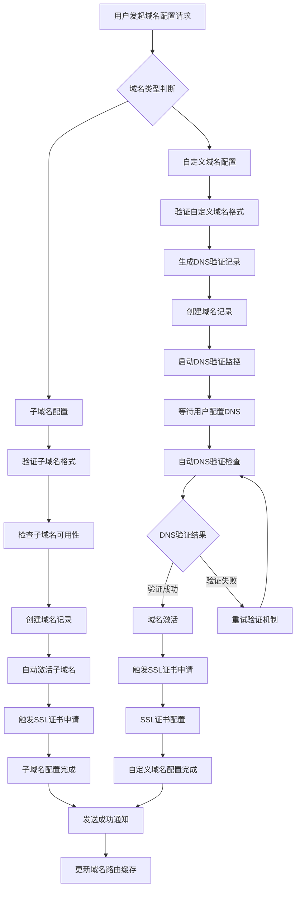

# 域名路由中间件系统

本中间件基于域名/子域名路由处理传入请求，实现多租户功能，允许不同域名服务不同的出版物内容。

## 📋 系统概述

域名路由中间件的核心功能：

1. **提取Host头部**：从传入请求中获取域名信息
2. **解析域名到出版物**：使用域名服务查找域名对应的出版物
3. **添加出版物上下文**：将出版物信息注入到请求中，供下游处理器使用
4. **启用域名特定路由**：允许相同路由根据域名提供不同内容

## 🔄 工作原理

### 中间件处理流程

```
带有Host头部的传入请求
         ↓
提取并清理域名（移除端口）
         ↓
查询域名服务查找出版物
         ↓
如果找到出版物：
  - 获取出版物详细信息
  - 创建PublicationContext
  - 添加到请求扩展中
         ↓
继续执行下一个中间件/处理器
```

### 支持的域名类型

1. **子域名**：`myblog.platform.com`
   - 自动创建，即时生效
   - 格式验证：3-63个字符，仅限字母数字和连字符
   - 基于平台主域名

2. **自定义域名**：`blog.example.com`
   - 需要DNS验证
   - 支持SSL证书自动配置
   - 完全自定义的域名

### 出版物上下文结构

```rust
pub struct PublicationContext {
    pub publication_id: String,    // 出版物ID
    pub publication: Publication,  // 出版物详细信息
    pub domain: String,           // 当前访问域名
    pub is_custom_domain: bool,   // 是否为自定义域名
}
```

## ⚙️ 配置说明

中间件需要以下环境变量配置：

```bash
# 子域名的基础域名（例如："platform.com"）
BASE_DOMAIN=platform.local

# DNS验证超时时间（秒）
DNS_VERIFICATION_TIMEOUT=30

# SSL配置（可选）
SSL_PROVIDER_ENDPOINT=https://ssl-provider.com/api
SSL_PROVIDER_API_KEY=your_api_key
AUTO_PROVISION_SSL=true
SSL_WEBHOOK_URL=https://your-app.com/ssl-webhook
```

## 🚀 使用示例

### 设置域名路由

中间件在 `main.rs` 中自动应用：

```rust
let app = Router::new()
    // 你的路由在这里
    .layer(middleware::from_fn_with_state(
        app_state.clone(),
        utils::middleware::domain_routing_middleware,
    ))
    .with_state(app_state);
```

### 在处理器中使用出版物上下文

#### 可选出版物上下文

```rust
use crate::utils::middleware::OptionalPublicationContext;

async fn handler(
    OptionalPublicationContext(context): OptionalPublicationContext,
) -> Result<Json<Value>> {
    match context {
        Some(pub_context) => {
            // 处理带有出版物上下文的请求
            println!("通过 {} 域名服务 {}", pub_context.domain, pub_context.publication.name);
            
            // 获取出版物特定的内容
            let articles = get_articles_by_publication(&pub_context.publication_id).await?;
            
            Ok(Json(json!({
                "publication": pub_context.publication.name,
                "domain": pub_context.domain,
                "articles": articles,
                "is_custom_domain": pub_context.is_custom_domain
            })))
        }
        None => {
            // 处理没有出版物上下文的请求（主平台）
            let all_articles = get_platform_articles().await?;
            
            Ok(Json(json!({
                "platform": "Rainbow Blog",
                "articles": all_articles
            })))
        }
    }
}
```

#### 必需出版物上下文

```rust
use crate::utils::middleware::RequiredPublicationContext;

async fn publication_only_handler(
    RequiredPublicationContext(context): RequiredPublicationContext,
) -> Result<Json<Value>> {
    // 此处理器仅在通过出版物域名访问时工作
    // 如果没有出版物上下文则返回错误
    
    let articles = get_articles_for_publication(&context.publication_id).await?;
    let writers = get_publication_writers(&context.publication_id).await?;
    
    Ok(Json(json!({
        "publication": {
            "id": context.publication_id,
            "name": context.publication.name,
            "description": context.publication.description,
            "domain": context.domain
        },
        "content": {
            "articles": articles,
            "writers": writers
        },
        "meta": {
            "is_custom_domain": context.is_custom_domain,
            "theme_color": context.publication.theme_color
        }
    })))
}
```

## 🌐 域名特定路由

### 出版物内容路由

这些路由根据域名表现不同：

```rust
// GET / 
// - 通过 platform.com → 平台主页
// - 通过 myblog.platform.com → MyBlog 主页
// - 通过 blog.example.com → 自定义域名博客主页

// GET /articles
// - 通过 platform.com → 所有平台文章
// - 通过 myblog.platform.com → 仅 MyBlog 文章
// - 通过 blog.example.com → 仅自定义域名博客文章

// GET /about
// - 通过 platform.com → 平台关于页面
// - 通过 myblog.platform.com → MyBlog 关于页面
// - 通过 blog.example.com → 自定义博客关于页面

// GET /writers
// - 通过 platform.com → 所有平台作者
// - 通过 myblog.platform.com → MyBlog 作者团队
// - 通过 blog.example.com → 自定义博客作者团队
```

### API路由行为

API路由保持 `/api/blog/` 前缀，在任何域名下都正常工作：

```rust
// 这些在任何域名下都相同：
// - platform.com/api/blog/articles
// - myblog.platform.com/api/blog/articles
// - blog.example.com/api/blog/articles
```

### 域名感知的API路由

一些API路由也可以是域名感知的：

```rust
// GET /api/content/articles
// - 如果有出版物上下文，返回按出版物过滤的文章
// - 如果没有出版物上下文，返回所有文章

// GET /api/content/stats
// - 如果有出版物上下文，返回出版物统计数据
// - 如果没有出版物上下文，返回平台统计数据
```

## 📊 域名管理与自动化流程

### 🔄 全自动化域名配置流程

域名配置是一个**完全自动化**的过程，用户只需要提供基本信息，系统会自动处理所有技术细节：

#### 📋 整体流程概览



### 🛠️ 子域名自动配置流程

#### 1. 用户请求创建子域名

```bash
POST /api/blog/publications/{id}/domains/subdomain
Content-Type: application/json

{
    "subdomain": "myblog",
    "is_primary": true
}
```

#### 2. 系统自动执行的操作

**第一步：请求验证** (0-1秒)
```rust
// 代码流程：src/routes/domain.rs -> create_subdomain()
1. 验证用户权限（必须是出版物所有者或编辑）
2. 验证子域名格式（3-63字符，仅限字母数字和连字符）
3. 检查子域名是否在保留列表中
4. 验证出版物存在且活跃
```

**第二步：可用性检查** (1-2秒)
```rust
// 代码流程：src/services/domain.rs -> check_subdomain_availability()
1. 查询数据库检查子域名是否已被使用
2. 检查DNS记录确认子域名未被占用
3. 验证子域名符合命名规范
```

**第三步：创建域名记录** (2-3秒)
```rust
// 代码流程：src/services/domain.rs -> create_subdomain()
1. 在数据库中创建 publication_domain 记录
2. 设置域名状态为 "active"（子域名无需验证）
3. 设置SSL状态为 "pending"
4. 如果是主域名，更新其他域名的主域名状态
```

**第四步：自动SSL配置** (3-30秒)
```rust
// 代码流程：src/services/domain.rs -> provision_ssl_certificate()
1. 调用SSL提供商API申请证书
2. 自动配置SSL证书到CDN/负载均衡器
3. 更新SSL状态为 "active" 或 "failed"
4. 设置证书过期时间和自动续期
```

**第五步：更新路由缓存** (30-31秒)
```rust
// 代码流程：src/utils/middleware.rs -> update_domain_cache()
1. 清除相关的域名解析缓存
2. 预热新域名的路由缓存
3. 更新负载均衡器配置
```

**响应示例：**
```json
{
    "success": true,
    "data": {
        "domain_id": "domain_123",
        "subdomain": "myblog",
        "full_domain": "myblog.platform.com",
        "status": "active",
        "ssl_status": "pending", // 将在30秒内变为 "active"
        "is_immediately_available": true,
        "estimated_ssl_ready_time": "2024-01-01T00:00:30Z",
        "created_at": "2024-01-01T00:00:00Z"
    }
}
```

### 🌐 自定义域名自动配置流程

#### 1. 用户请求添加自定义域名

```bash
POST /api/blog/publications/{id}/domains/custom
Content-Type: application/json

{
    "domain": "blog.example.com",
    "is_primary": false
}
```

#### 2. 系统自动执行的操作

**第一步：请求验证和准备** (0-2秒)
```rust
// 代码流程：src/routes/domain.rs -> add_custom_domain()
1. 验证用户权限
2. 验证域名格式（符合RFC标准）
3. 检查域名是否已被其他出版物使用
4. 验证域名不在黑名单中
```

**第二步：生成验证记录** (2-3秒)
```rust
// 代码流程：src/services/domain.rs -> generate_verification_records()
1. 生成唯一的验证令牌
2. 创建TXT验证记录（所有权验证）
3. 创建CNAME验证记录（路由配置）
4. 在数据库中存储验证记录
```

**第三步：创建域名记录** (3-4秒)
```rust
// 代码流程：src/services/domain.rs -> create_custom_domain()
1. 在数据库中创建 publication_domain 记录
2. 设置域名状态为 "pending"
3. 创建 domain_verification_record 记录
4. 启动自动验证任务
```

**第四步：启动自动DNS监控** (4-5秒)
```rust
// 代码流程：src/services/domain.rs -> start_dns_monitoring()
1. 创建后台验证任务
2. 设置定时检查（每5分钟检查一次）
3. 配置验证超时时间（24小时）
4. 设置验证成功回调
```

**响应示例：**
```json
{
    "success": true,
    "data": {
        "domain_id": "domain_456",
        "custom_domain": "blog.example.com",
        "status": "pending",
        "verification_records": [
            {
                "type": "TXT",
                "name": "_rainbow-verify.blog.example.com",
                "value": "rainbow-verify-abc123def456",
                "purpose": "ownership_verification"
            },
            {
                "type": "CNAME", 
                "name": "blog.example.com",
                "value": "domains.platform.com",
                "purpose": "routing_configuration"
            }
        ],
        "next_steps": [
            "请在您的DNS提供商中添加以上DNS记录",
            "系统将自动检测DNS记录配置",
            "验证成功后将自动激活域名和SSL证书"
        ],
        "auto_verification": {
            "enabled": true,
            "check_interval": "5分钟",
            "timeout": "24小时",
            "next_check_at": "2024-01-01T00:05:00Z"
        }
    }
}
```

### 🔍 自动DNS验证流程

系统启动后台任务，自动执行DNS验证：

#### 验证任务执行流程

```rust
// 代码流程：src/services/domain.rs -> verify_domain_dns()

async fn automatic_dns_verification_task(domain_id: String) {
    loop {
        // 第一步：检查TXT记录（所有权验证）
        let txt_verified = verify_txt_record(&domain_id).await;
        
        // 第二步：检查CNAME记录（路由配置）
        let cname_verified = verify_cname_record(&domain_id).await;
        
        // 第三步：更新验证状态
        update_verification_status(&domain_id, txt_verified, cname_verified).await;
        
        // 第四步：如果全部验证成功，激活域名
        if txt_verified && cname_verified {
            activate_domain(&domain_id).await;
            provision_ssl_certificate(&domain_id).await;
            break; // 验证成功，退出循环
        }
        
        // 第五步：检查超时
        if is_verification_timeout(&domain_id).await {
            mark_domain_failed(&domain_id).await;
            break; // 验证超时，退出循环
        }
        
        // 等待5分钟后重试
        tokio::time::sleep(Duration::from_secs(300)).await;
    }
}
```

#### DNS验证详细步骤

**TXT记录验证：**
```rust
async fn verify_txt_record(domain_id: &str) -> bool {
    // 1. 获取域名和验证令牌
    let domain_record = get_domain_record(domain_id).await;
    let verification_token = domain_record.verification_token;
    
    // 2. 查询DNS TXT记录
    let txt_query = format!("_rainbow-verify.{}", domain_record.custom_domain);
    
    match dns_resolver.txt_lookup(&txt_query).await {
        Ok(txt_records) => {
            // 3. 检查是否包含验证令牌
            for record in txt_records.iter() {
                if record.to_string().contains(&verification_token) {
                    // 4. 更新数据库验证状态
                    update_verification_record_status(domain_id, "TXT", true).await;
                    return true;
                }
            }
            false
        }
        Err(_) => false
    }
}
```

**CNAME记录验证：**
```rust
async fn verify_cname_record(domain_id: &str) -> bool {
    // 1. 获取域名信息
    let domain_record = get_domain_record(domain_id).await;
    let expected_target = format!("domains.{}", config.base_domain);
    
    // 2. 查询DNS CNAME记录
    match dns_resolver.cname_lookup(&domain_record.custom_domain).await {
        Ok(cname_records) => {
            // 3. 检查CNAME目标
            for record in cname_records.iter() {
                if record.to_string() == expected_target {
                    // 4. 更新数据库验证状态
                    update_verification_record_status(domain_id, "CNAME", true).await;
                    return true;
                }
            }
            false
        }
        Err(_) => false
    }
}
```

### 🔐 自动SSL证书配置流程

当域名验证成功后，系统自动配置SSL证书：

```rust
// 代码流程：src/services/domain.rs -> provision_ssl_certificate()

async fn provision_ssl_certificate(domain_id: &str) {
    // 第一步：准备SSL申请
    let domain_record = get_domain_record(domain_id).await;
    let domain_name = domain_record.get_domain_name();
    
    // 第二步：调用SSL提供商API
    let ssl_request = CreateSSLCertificateRequest {
        domain: domain_name.clone(),
        validation_method: "dns", // DNS验证方式
        auto_renew: true,
    };
    
    match ssl_provider.create_certificate(ssl_request).await {
        Ok(certificate_info) => {
            // 第三步：保存证书信息
            save_ssl_certificate_info(&domain_id, &certificate_info).await;
            
            // 第四步：配置到CDN/负载均衡器
            configure_ssl_on_infrastructure(&domain_name, &certificate_info).await;
            
            // 第五步：更新域名SSL状态
            update_domain_ssl_status(&domain_id, "active").await;
            
            // 第六步：设置自动续期任务
            schedule_ssl_renewal(&domain_id, certificate_info.expires_at).await;
        }
        Err(error) => {
            // SSL申请失败，记录错误并重试
            log::error!("SSL certificate provision failed for {}: {}", domain_name, error);
            update_domain_ssl_status(&domain_id, "failed").await;
            
            // 30分钟后重试
            schedule_ssl_retry(&domain_id, Duration::from_secs(1800)).await;
        }
    }
}
```

### 📬 自动通知流程

系统在各个关键节点自动发送通知：

```rust
// 代码流程：src/services/realtime.rs -> notify_domain_events()

// 1. 子域名创建成功通知
async fn notify_subdomain_created(user_id: &str, domain_info: &PublicationDomain) {
    let notification = CreateNotificationRequest {
        recipient_id: user_id.to_string(),
        notification_type: NotificationType::DomainConfigured,
        title: "子域名配置成功".to_string(),
        message: format!("您的子域名 {} 已成功配置并激活", domain_info.get_full_domain()),
        data: json!({
            "domain_id": domain_info.id,
            "domain": domain_info.get_full_domain(),
            "status": "active",
            "ssl_status": domain_info.ssl_status
        }),
    };
    
    // 发送实时通知
    realtime_service.send_notification(user_id, &notification).await;
}

// 2. DNS验证成功通知
async fn notify_dns_verified(user_id: &str, domain_info: &PublicationDomain) {
    let notification = CreateNotificationRequest {
        recipient_id: user_id.to_string(),
        notification_type: NotificationType::DomainVerified,
        title: "域名验证成功".to_string(),
        message: format!("您的自定义域名 {} DNS验证已完成，正在配置SSL证书", domain_info.custom_domain.as_ref().unwrap()),
        data: json!({
            "domain_id": domain_info.id,
            "domain": domain_info.custom_domain,
            "status": "active",
            "ssl_status": "pending"
        }),
    };
    
    realtime_service.send_notification(user_id, &notification).await;
}

// 3. SSL证书配置完成通知
async fn notify_ssl_configured(user_id: &str, domain_info: &PublicationDomain) {
    let notification = CreateNotificationRequest {
        recipient_id: user_id.to_string(),
        notification_type: NotificationType::SSLConfigured,
        title: "SSL证书配置完成".to_string(),
        message: format!("您的域名 {} SSL证书已成功配置，网站已完全可用", domain_info.get_full_domain()),
        data: json!({
            "domain_id": domain_info.id,
            "domain": domain_info.get_full_domain(),
            "status": "active",
            "ssl_status": "active",
            "full_url": format!("https://{}", domain_info.get_full_domain())
        }),
    };
    
    realtime_service.send_notification(user_id, &notification).await;
}
```

### 🔄 持续监控和维护

系统持续监控域名状态并自动维护：

#### SSL证书自动续期
```rust
// 每天执行的自动续期检查任务
async fn ssl_renewal_check_task() {
    let expiring_certificates = get_expiring_certificates(30).await; // 30天内过期
    
    for cert in expiring_certificates {
        match renew_ssl_certificate(&cert.domain_id).await {
            Ok(_) => {
                log::info!("SSL certificate renewed for domain: {}", cert.domain);
                notify_ssl_renewed(&cert.owner_id, &cert).await;
            }
            Err(error) => {
                log::error!("SSL renewal failed for domain {}: {}", cert.domain, error);
                notify_ssl_renewal_failed(&cert.owner_id, &cert, &error).await;
            }
        }
    }
}
```

#### 域名健康检查
```rust
// 每小时执行的域名健康检查
async fn domain_health_check_task() {
    let active_domains = get_active_domains().await;
    
    for domain in active_domains {
        // 检查域名是否仍然指向正确的服务器
        if let Err(_) = verify_domain_routing(&domain).await {
            log::warn!("Domain routing issue detected: {}", domain.get_full_domain());
            // 尝试自动修复或通知管理员
        }
        
        // 检查SSL证书状态
        if let Err(_) = verify_ssl_certificate(&domain).await {
            log::warn!("SSL certificate issue detected: {}", domain.get_full_domain());
            // 尝试重新配置SSL证书
        }
    }
}
```

### 📊 用户实时状态查询

用户可以随时查询域名配置状态：

```bash
# 查询域名配置进度
GET /api/blog/domains/{domain_id}/status

# 实时响应示例：
{
    "success": true,
    "data": {
        "domain_id": "domain_456",
        "status": "verifying", // pending, verifying, active, failed
        "progress": {
            "current_step": "dns_verification",
            "completed_steps": ["domain_created", "verification_records_generated"],
            "remaining_steps": ["dns_verification", "ssl_provisioning"],
            "estimated_completion": "2024-01-01T00:15:00Z"
        },
        "verification_status": {
            "txt_record": {
                "verified": true,
                "verified_at": "2024-01-01T00:05:00Z"
            },
            "cname_record": {
                "verified": false,
                "last_check": "2024-01-01T00:10:00Z",
                "next_check": "2024-01-01T00:15:00Z"
            }
        },
        "ssl_status": "pending",
        "last_updated": "2024-01-01T00:10:30Z"
    }
}
```

## 🚨 错误处理

### 域名未找到

当域名不映射到任何出版物时：
- 请求继续进行，但没有出版物上下文
- `OptionalPublicationContext` 将为 `None`
- `RequiredPublicationContext` 将返回 400 Bad Request

### 出版物未找到

当域名映射到出版物ID但出版物不存在时：
- 记录警告日志
- 请求继续进行，但没有出版物上下文

### DNS解析错误

- 记录为警告级别日志
- 请求不会失败，继续进行
- 域名验证端点会报告具体错误

**错误响应示例：**
```json
{
    "success": false,
    "error": {
        "code": "DNS_RESOLUTION_FAILED",
        "message": "无法解析DNS记录",
        "details": {
            "record_type": "TXT",
            "record_name": "_rainbow-verify.blog.example.com",
            "error": "域名不存在"
        }
    }
}
```

## 🔒 安全考虑

### 域名验证

- **子域名验证**：格式和可用性检查
- **自定义域名验证**：格式和所有权验证
- **DNS验证**：自定义域名需要DNS验证
- **防止域名劫持**：验证令牌机制

### SSL/TLS安全

- **自动SSL配置**：为已验证域名自动配置SSL
- **SSL状态跟踪**：监控SSL证书状态和续期
- **HSTS头部**：为HTTPS域名设置HSTS头部
- **证书续期**：自动检测并续期即将过期的证书

### 速率限制

- **基于IP的速率限制**：无论域名如何，每个IP都有速率限制
- **出版物级别限制**：可扩展为每个出版物的速率限制
- **域名级别限制**：可配置每个域名的访问限制

### 访问控制

- **出版物权限**：检查用户对出版物的访问权限
- **域名管理权限**：仅出版物所有者和编辑可管理域名
- **DNS验证权限**：确保只有域名所有者可以验证域名

## ⚡ 性能优化

### 缓存策略

- **域名映射缓存**：缓存域名到出版物ID的映射
- **出版物详情缓存**：缓存出版物详细信息
- **DNS解析缓存**：缓存DNS解析结果
- **SSL状态缓存**：缓存SSL证书状态

**缓存配置示例：**
```rust
// 域名映射缓存：1小时
domain_mapping_cache_ttl: 3600,

// 出版物详情缓存：30分钟  
publication_cache_ttl: 1800,

// DNS解析缓存：15分钟
dns_cache_ttl: 900,
```

### 数据库优化

- **单次查询解析**：一次查询解析域名到出版物ID
- **批量查询优化**：批量获取出版物详情
- **索引优化**：为域名查询添加适当索引
- **连接池管理**：优化数据库连接使用

### 请求处理优化

- **异步处理**：所有域名解析操作都是异步的
- **并行查询**：并行执行DNS验证检查
- **错误处理优化**：快速失败，避免长时间等待

## 📈 监控和日志

### 日志记录

- **域名解析尝试**：记录所有域名解析请求
- **出版物上下文创建**：记录上下文创建成功/失败
- **SSL配置事件**：记录SSL证书配置和更新
- **DNS验证结果**：记录DNS验证成功/失败

**日志格式示例：**
```log
[INFO] Domain resolution: blog.example.com -> publication_123
[WARN] Publication not found for domain: old-blog.example.com -> publication_999  
[INFO] SSL certificate provisioned for: blog.example.com
[ERROR] DNS verification failed: _rainbow-verify.blog.example.com TXT record not found
```

### 性能指标

- **域名解析成功率**：成功解析的域名请求百分比
- **SSL证书状态**：活跃/过期/失败的证书数量
- **出版物访问模式**：各出版物的访问频率分析
- **DNS验证时间**：DNS验证的平均耗时

### 监控警报

- **SSL证书即将过期**：证书过期前30天发出警报
- **域名解析失败率高**：解析失败率超过5%时警报
- **DNS验证持续失败**：同一域名验证失败超过3次时警报

## 🔄 迁移和兼容性

### 现有路由兼容性

所有现有路由通过主平台域名继续工作：
- `platform.com/api/blog/*` → 完整API访问
- `platform.com/` → 平台主页
- `platform.com/articles` → 所有文章列表

### 新域名路由

域名特定路由是附加功能：
- `myblog.platform.com/` → 出版物主页
- `myblog.platform.com/articles` → 出版物文章
- `myblog.platform.com/about` → 出版物关于页面

### 向后兼容性

- **API无破坏性变更**：现有API保持完全兼容
- **可选出版物上下文**：大多数路由的出版物上下文是可选的
- **客户端无需修改**：现有客户端无需任何修改即可继续工作

## 🛠️ 故障排除

### 常见问题

1. **域名无法解析**
   ```bash
   # 检查DNS记录
   dig TXT _rainbow-verify.blog.example.com
   dig CNAME blog.example.com
   
   # 验证域名已添加到出版物
   GET /api/blog/publications/{id}/domains
   
   # 检查域名验证状态  
   GET /api/blog/domains/{domain_id}
   ```

2. **出版物上下文不可用**
   - 验证中间件已应用
   - 检查域名服务配置
   - 确保出版物存在且处于活跃状态

3. **SSL问题**
   ```bash
   # 检查SSL提供商配置
   echo $SSL_PROVIDER_ENDPOINT
   echo $SSL_PROVIDER_API_KEY
   
   # 验证域名验证已完成
   GET /api/blog/domains/{domain_id}/verify
   
   # 检查SSL证书状态
   GET /api/blog/domains/{domain_id}
   ```

### 调试日志

启用调试日志查看中间件操作：

```bash
export LOG_LEVEL=rainbow_blog=debug,tower_http=debug
```

调试日志将显示：
- 从Host头部提取域名
- 域名到出版物的解析过程
- 出版物上下文创建
- SSL配置尝试
- DNS验证详细过程

### 健康检查

系统提供健康检查端点：

```bash
# 检查域名服务状态
GET /api/health/domains

# 检查SSL服务状态  
GET /api/health/ssl

# 检查DNS解析服务状态
GET /api/health/dns
```

**健康检查响应示例：**
```json
{
    "status": "healthy",
    "services": {
        "domain_service": "ok",
        "ssl_provider": "ok", 
        "dns_resolver": "ok"
    },
    "metrics": {
        "active_domains": 156,
        "pending_ssl_certificates": 3,
        "failed_dns_verifications": 0
    },
    "timestamp": "2024-01-01T12:00:00Z"
}
```

## 📚 最佳实践

### 域名命名规范

- **子域名**：使用小写字母、数字和连字符
- **长度限制**：3-63个字符
- **避免保留词**：admin、api、www、mail等
- **语义化**：使用有意义的名称，如品牌名或主题

### SSL证书管理

- **自动续期**：启用SSL证书自动续期
- **监控过期**：设置证书过期警报
- **测试验证**：定期测试SSL证书配置
- **备份计划**：准备SSL配置失败的备用方案

### 性能优化建议

- **启用缓存**：为域名解析和出版物数据启用适当缓存
- **数据库索引**：确保域名相关查询有适当索引
- **连接池**：配置合适的数据库连接池大小
- **异步处理**：使用异步处理避免阻塞请求

### 安全最佳实践

- **定期审计**：定期审计域名配置和权限
- **访问日志**：记录所有域名相关的访问和修改
- **权限最小化**：仅给必要的用户域名管理权限
- **验证检查**：定期检查DNS验证状态